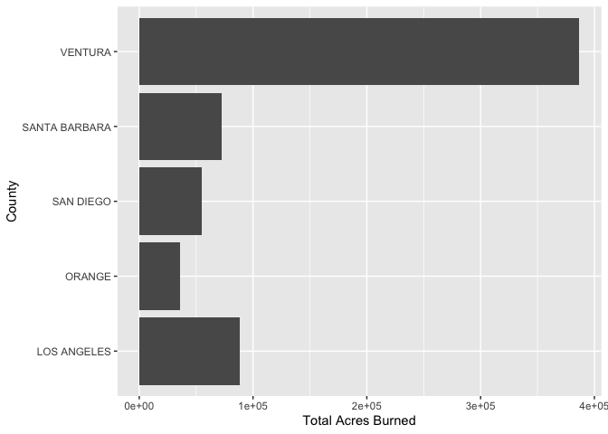
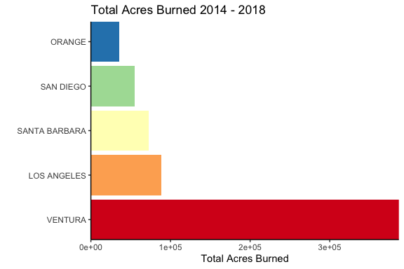
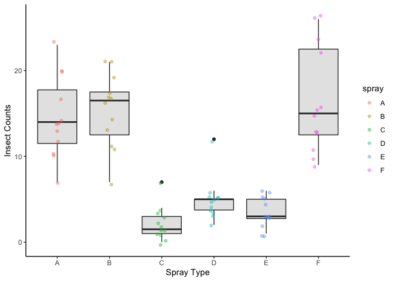
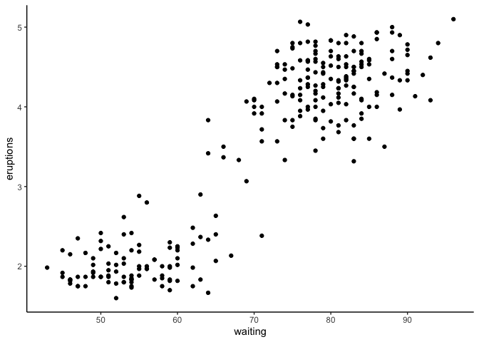

IntroRmarkdown
================
Nicholas Baetge
8/26/2020

**This document was adapted from ESM206**

### Objectives

  - RMarkdown introduction (creating, some formatting, knitting)
  - Data wrangling continued (rename, group\_by, summarize)

### 1\. What is markdown?

Introduce markdown. Point out differences between markdown and scripts.
Why is this useful? Document preparation + embedded code - you can do
everything in the same place (write, analyze, produce final figures…).
That means better reproducibility.

### 2\. Some basics in markdown formatting…

# One pound sign: Large heading

## More means smaller headings

Just writing text is regular text

We can *italicize* using a single asterisk Or **bold** using double
asterisks

1.  Or
2.  make
3.  numbered
4.  lists

And when we’re ready to prepare a report, we press KNIT to convert to a
supported document type (today we’ll use knitting to HTML)

But we can do all of that in a Word document. Why is markdown special?
Because it allows us to do **all of our writing and data analysis and
data visualization in the SAME PLACE\!** Can you imagine not having 15
files with your different analyses, and a different Word document with
your text, and different files for all of your figures? That is not an
easy way to reproduce computational data science…

### 3\. Embedding code into Rmarkdown (+ data wrangling review)

To add code in Rmarkdown, Insert an R code chunk (Insert \> R) (or
shortcut command + shift + i on Mac; control + alt + i in Windows). You
will see a new shaded region appear. That’s where you’ll include any
active code AND commenting (you can treat these shaded areas like you
would a script).

First, let’s load the tidyverse and our CAL FIRE data.

``` r
####### This area works like a script:

library(tidyverse) # Loads the tidyverse
```

    ## ── Attaching packages ──────────────────────────────────────────────────────────────────────── tidyverse 1.3.0 ──

    ## ✓ ggplot2 3.3.0     ✓ purrr   0.3.4
    ## ✓ tibble  3.0.1     ✓ dplyr   0.8.5
    ## ✓ tidyr   1.0.3     ✓ stringr 1.4.0
    ## ✓ readr   1.3.1     ✓ forcats 0.5.0

    ## ── Conflicts ─────────────────────────────────────────────────────────────────────────── tidyverse_conflicts() ──
    ## x dplyr::filter() masks stats::filter()
    ## x dplyr::lag()    masks stats::lag()

``` r
library(RColorBrewer) # (just for my graph example)
library(lubridate) # mess with time!
```

    ## 
    ## Attaching package: 'lubridate'

    ## The following objects are masked from 'package:dplyr':
    ## 
    ##     intersect, setdiff, union

    ## The following objects are masked from 'package:base':
    ## 
    ##     date, intersect, setdiff, union

``` r
library(readxl) # Allows loading of excel files

calfire.data <- read_excel("~/GITHUB/eemb144l/Input_Data/week1/2013_2019_CALFIRE_Redbook.xlsx", sheet = "Data") # read in the data (use ":" and "/" or "\" on windows)

calfire.metadata <- read_excel("~/GITHUB/eemb144l/Input_Data/week1/2013_2019_CalFire_Redbook.xlsx", sheet = "Metadata")  # read in the metadata

####### Basic data exploration:

View(calfire.data)
```

    ## Warning in system2("/usr/bin/otool", c("-L", shQuote(DSO)), stdout = TRUE):
    ## running command ''/usr/bin/otool' -L '/Library/Frameworks/R.framework/Resources/
    ## modules/R_de.so'' had status 1

``` r
names(calfire.data)
```

    ##  [1] "Incident"             "County_Unit"          "Fire_Name"           
    ##  [4] "Start_Date"           "Controlled_Date"      "Origin_DPA_Agency"   
    ##  [7] "Total_Acres_Burned"   "Veg_Type"             "Cause"               
    ## [10] "Structures_Destroyed" "Structures_Damaged"   "Fire_Fatalities"     
    ## [13] "Civil_Fatalities"

``` r
summary(calfire.data) 
```

    ##    Incident         County_Unit         Fire_Name        
    ##  Length:378         Length:378         Length:378        
    ##  Class :character   Class :character   Class :character  
    ##  Mode  :character   Mode  :character   Mode  :character  
    ##                                                          
    ##                                                          
    ##                                                          
    ##                                                          
    ##    Start_Date                  Controlled_Date               Origin_DPA_Agency 
    ##  Min.   :2014-01-02 00:00:00   Min.   :2014-01-10 00:00:00   Length:378        
    ##  1st Qu.:2015-08-16 00:00:00   1st Qu.:2015-09-17 06:00:00   Class :character  
    ##  Median :2017-06-14 00:00:00   Median :2017-06-18 00:00:00   Mode  :character  
    ##  Mean   :2016-12-01 16:15:14   Mean   :2016-12-08 04:49:31                     
    ##  3rd Qu.:2017-10-08 00:00:00   3rd Qu.:2017-10-31 00:00:00                     
    ##  Max.   :2028-07-09 00:00:00   Max.   :2018-12-22 00:00:00                     
    ##                                                                                
    ##  Total_Acres_Burned   Veg_Type            Cause           Structures_Destroyed
    ##  Min.   :    76.0   Length:378         Length:378         Min.   :   1.0      
    ##  1st Qu.:   591.5   Class :character   Class :character   1st Qu.:   2.0      
    ##  Median :  1670.0   Mode  :character   Mode  :character   Median :   6.0      
    ##  Mean   : 12629.4                                         Mean   : 140.2      
    ##  3rd Qu.:  6354.8                                         3rd Qu.:  28.5      
    ##  Max.   :410203.0                                         Max.   :5636.0      
    ##                                                           NA's   :235         
    ##  Structures_Damaged Fire_Fatalities Civil_Fatalities
    ##  Min.   :  1.00     Min.   :1.0     Min.   : 1.000  
    ##  1st Qu.:  1.00     1st Qu.:1.0     1st Qu.: 1.000  
    ##  Median :  4.00     Median :1.0     Median : 3.000  
    ##  Mean   : 34.82     Mean   :1.3     Mean   : 8.882  
    ##  3rd Qu.: 11.50     3rd Qu.:1.0     3rd Qu.: 4.000  
    ##  Max.   :754.00     Max.   :3.0     Max.   :86.000  
    ##  NA's   :295        NA's   :368     NA's   :361

Looks like it loaded successfully. We’re only really interested in five
variables: county (County\_Unit), fire (Fire\_Name), start
(Start\_Date), total acres burned (Total\_Acres\_Burned), and cause
(Cause).

First, let’s do the following: (1) Select only those columns (2) Rename
the columns to something shorter

Then, let’s: (1) Restrict our data to the Southern California coast
(incl Thomas Fire) (2) Add a column that represents the year the fire
took place (3) Change the county representing the Thomas Fire from
“Ventura/Santa Barbara” to “Ventura”

``` r
calfire_subset <- calfire.data %>% 
  select(County_Unit, Fire_Name, Start_Date, Controlled_Date, Total_Acres_Burned, Cause) %>% 
  rename(county = County_Unit, fire = Fire_Name, start = Start_Date, end = Controlled_Date, acres = Total_Acres_Burned, cause = Cause) %>% 
  filter(county %in% c("SANTA BARBARA", "VENTURA", "LOS ANGELES", "ORANGE", "SAN DIEGO") | fire == "THOMAS") %>% 
   mutate(year = year(start),
          county = ifelse(fire == "THOMAS", "VENTURA", county))

View(calfire_subset)
```

    ## Warning in system2("/usr/bin/otool", c("-L", shQuote(DSO)), stdout = TRUE):
    ## running command ''/usr/bin/otool' -L '/Library/Frameworks/R.framework/Resources/
    ## modules/R_de.so'' had status 1

Now I’m back to working just in the document again. Remember to knit
frequently to see what happens.

What if I don’t want my code or messages/outputs to show up in my
knitted document? Then in the chunk header I can use things like ‘echo =
FALSE’, ‘message = FALSE’, results = “hide”. Let’s see what happens:

``` r
# Show what happens when you add the lines above and knit...
names(calfire_subset)
```

    ## [1] "county" "fire"   "start"  "end"    "acres"  "cause"  "year"

Now that entire code + results is hidden in the knitted document. Here,
direct them to the RCheatsheets (Help \> Cheatsheets).

### 4\. Summary statistics and group\_by()

Let’s say that for our data, I want to find the TOTAL acres burned in
each county. I could create subsets for each of the counties, then use
whatever function I wanted on the ‘acres’ column. Instead, we can ask R
to add “behind the scenes” grouping to the data, then calculate summary
statistics using ‘summarize’ and whichever summary statistics you want
to find.

``` r
summary <- calfire_subset %>% 
  group_by(county) %>% 
  summarize(
    total_acres = sum(acres)
  ) %>% 
  arrange(-total_acres)

summary
```

    ## # A tibble: 5 x 2
    ##   county        total_acres
    ##   <chr>               <dbl>
    ## 1 VENTURA            386815
    ## 2 LOS ANGELES         88363
    ## 3 SANTA BARBARA       72328
    ## 4 SAN DIEGO           54920
    ## 5 ORANGE              35889

You can also group by multiple variables (e.g. if we had years, we could
group by county THEN by years, and we’d get a summary for acres burned
by county and years).

``` r
county_year_summary <- calfire_subset %>% 
  group_by(county, year) %>% 
  summarize(
    total_acres = sum(acres)
  ) %>% 
  ungroup() %>% 
  arrange(-year, -total_acres) 

county_year_summary
```

    ## # A tibble: 20 x 3
    ##    county         year total_acres
    ##    <chr>         <dbl>       <dbl>
    ##  1 VENTURA        2018      101330
    ##  2 ORANGE         2018       23025
    ##  3 LOS ANGELES    2018        4732
    ##  4 SAN DIEGO      2018        2690
    ##  5 VENTURA        2017      281893
    ##  6 LOS ANGELES    2017       30894
    ##  7 SANTA BARBARA  2017       18874
    ##  8 ORANGE         2017       11879
    ##  9 SAN DIEGO      2017        8879
    ## 10 SANTA BARBARA  2016       52822
    ## 11 LOS ANGELES    2016       48347
    ## 12 SAN DIEGO      2016        8854
    ## 13 VENTURA        2016        2304
    ## 14 SAN DIEGO      2015        8671
    ## 15 LOS ANGELES    2015        2438
    ## 16 VENTURA        2015        1288
    ## 17 SAN DIEGO      2014       25826
    ## 18 LOS ANGELES    2014        1952
    ## 19 ORANGE         2014         985
    ## 20 SANTA BARBARA  2014         632

What if I want to export that data frame as its own file (csv)? Use
write\_csv to send it to your working
directory.

``` r
write_csv(county_year_summary, "~/GITHUB/eemb144l/Output_Data/summary.csv")
```

Notice that it shows up where you put it\! Then you can copy/paste/email
whatever.

Let’s make a column graph of the total acres burned by cause

``` r
col.plot <- ggplot(summary, 
                     aes(x = county, 
                         y = total_acres)) +
  geom_col() +
  labs(x = "County", y = "Total Acres Burned") +
  coord_flip() 

col.plot
```

<!-- -->

``` r
# Notice if we do this, it just puts them in alphabetical order. If we want it to stay in the order from high to low, we need to reassign the causes as factors and explicitly set the levels (see below)

summary_factor <- summary %>% 
  mutate(county = factor(county, levels = county))

# NOW we can plot and that order will be retained...
```

``` r
ordered.plot <- ggplot(summary_factor, aes(x = county, y = total_acres)) +
  geom_col(aes(fill = county), show.legend = FALSE) +
  coord_flip() +
  scale_fill_brewer(palette = "Spectral") + # Note: need package RColorBrewer
  theme_classic() +
  scale_x_discrete(expand = c(0,0)) +
  scale_y_continuous(expand = c(0,0)) +
  labs(x = "", y = "Total Acres Burned", title = "Total Acres Burned 2014 - 2018") 

ordered.plot
```

<!-- -->

Notice that when we knit, it shows up in that document (so we can embed
final figures in a document, which will be automatically updated if we
change our data/analyses/code…).

Want to change the size of the final figure in the knitted document? You
can add fig.width or fig.height to the chunk header to specify (inches
is default).

### 5\. The datasets package and a boxplot

Want to do some practice with data analysis but don’t want to deal with
loading data every time? There are some datasets that exist in R for
just that purpose.

You can find them using library(help = “datasets”)…(run that in the
console window). There are some pretty fun ones to practice with.

Let’s check out one of them: InsectSprays Use ?InsectSprays in the
console to bring up information about the dataset

We want to make a boxplot (a different box + whisker for each of the
different insect sprays)

``` r
insect_boxplot <- ggplot(InsectSprays, aes(x = spray, y = count)) +
  geom_boxplot(fill = "gray90") +
  theme_classic() +
  labs(x = "Spray Type", y = "Insect Counts") +
  geom_jitter(width = 0.1, alpha = 0.4, aes(color = spray))

insect_boxplot
```

<!-- -->

To end: close entire project, reopen, run code: show how easy it is to
recreate EVERYTHING just by running the entire code.

IF extra time: explore the ‘faithful’ dataset (use ?faithful). In
ggplot, create a scatterplot of waiting time (x) versus eruption
duration (y), and customize.

``` r
faithful_plot <- ggplot(faithful, aes(x = waiting, y = eruptions)) +
  geom_point() +
  theme_classic()

faithful_plot
```

<!-- -->

``` r
# Always ask yourself: What are the major takeaways?
```
