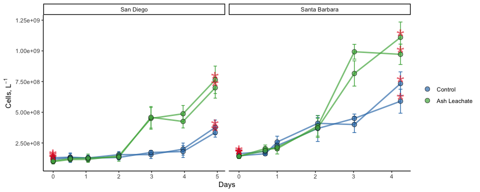
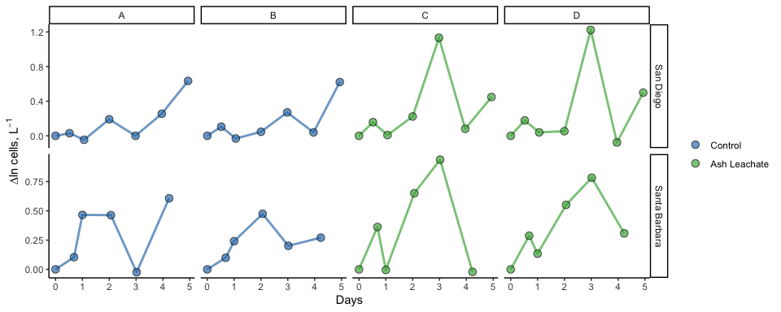
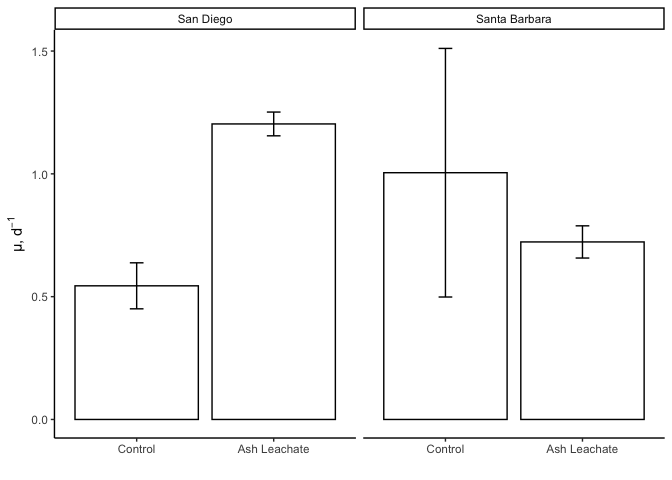
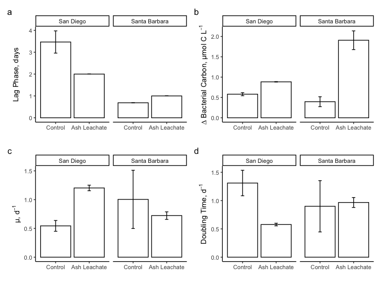

ACIDD Experiment Bacterial Abundance
================
Nicholas Baetge
8/26/2020

# Intro

This document shows how **individual bottle** bacterial abundance data
from ACIDD remineralization bioassays were processed, QC’d, and
analyzed.

``` r
library(tidyverse) 
library(readxl)
library(lubridate)
```

# Import data

Our data exists in two separate sheets of an excel file. We’ll take a
look at what is in those sheets and combine the data using a “join”
function

``` r
excel_sheets("~/GITHUB/eemb144l/Input_Data/week3/ACIDD_Exp_BactAbund.xlsx") #let's see what the excel sheets are called
```

    ## [1] "Metadata" "Data"

``` r
metadata <- read_excel("~/GITHUB/eemb144l/Input_Data/week3/ACIDD_Exp_BactAbund.xlsx", sheet = "Metadata") #import the first sheet containing metadata
names(metadata)
```

    ##  [1] "Experiment"              "Location"               
    ##  [3] "Temperature_C"           "Depth"                  
    ##  [5] "Bottle"                  "Timepoint"              
    ##  [7] "Treatment"               "Target_DOC_Amendment_uM"
    ##  [9] "Inoculum_L"              "Media_L"                
    ## [11] "Datetime"                "TOC_Sample"             
    ## [13] "DOC_Sample"              "Parallel_Sample"        
    ## [15] "Cell_Sample"             "DNA_Sample"             
    ## [17] "Nutrient_Sample"

``` r
data <- read_excel("~/GITHUB/eemb144l/Input_Data/week3/ACIDD_Exp_BactAbund.xlsx", sheet = "Data") #import the second sheet containing the cell abundances
names(data)
```

    ## [1] "Experiment"  "Bottle"      "Timepoint"   "Cells_ml"    "Cells_ml_sd"

``` r
joined <- left_join(metadata, data)
```

    ## Joining, by = c("Experiment", "Bottle", "Timepoint")

``` r
names(joined)
```

    ##  [1] "Experiment"              "Location"               
    ##  [3] "Temperature_C"           "Depth"                  
    ##  [5] "Bottle"                  "Timepoint"              
    ##  [7] "Treatment"               "Target_DOC_Amendment_uM"
    ##  [9] "Inoculum_L"              "Media_L"                
    ## [11] "Datetime"                "TOC_Sample"             
    ## [13] "DOC_Sample"              "Parallel_Sample"        
    ## [15] "Cell_Sample"             "DNA_Sample"             
    ## [17] "Nutrient_Sample"         "Cells_ml"               
    ## [19] "Cells_ml_sd"

``` r
summary(joined)
```

    ##   Experiment          Location         Temperature_C     Depth  
    ##  Length:84          Length:84          Min.   :15    Min.   :5  
    ##  Class :character   Class :character   1st Qu.:15    1st Qu.:5  
    ##  Mode  :character   Mode  :character   Median :15    Median :5  
    ##                                        Mean   :15    Mean   :5  
    ##                                        3rd Qu.:15    3rd Qu.:5  
    ##                                        Max.   :15    Max.   :5  
    ##                                                                 
    ##     Bottle            Timepoint       Treatment         Target_DOC_Amendment_uM
    ##  Length:84          Min.   : 0.000   Length:84          Min.   : 0             
    ##  Class :character   1st Qu.: 2.000   Class :character   1st Qu.: 0             
    ##  Mode  :character   Median : 5.000   Mode  :character   Median : 5             
    ##                     Mean   : 4.762                      Mean   : 5             
    ##                     3rd Qu.: 7.000                      3rd Qu.:10             
    ##                     Max.   :10.000                      Max.   :10             
    ##                                                                                
    ##    Inoculum_L     Media_L    Datetime         TOC_Sample      DOC_Sample     
    ##  Min.   :1.5   Min.   :4   Length:84          Mode :logical   Mode :logical  
    ##  1st Qu.:1.5   1st Qu.:4   Class :character   FALSE:64        FALSE:48       
    ##  Median :1.5   Median :4   Mode  :character   TRUE :20        TRUE :36       
    ##  Mean   :1.5   Mean   :4                                                     
    ##  3rd Qu.:1.5   3rd Qu.:4                                                     
    ##  Max.   :1.5   Max.   :4                                                     
    ##                                                                              
    ##  Parallel_Sample Cell_Sample     DNA_Sample      Nutrient_Sample
    ##  Mode :logical   Mode :logical   Mode :logical   Mode :logical  
    ##  FALSE:44        FALSE:28        FALSE:68        FALSE:68       
    ##  TRUE :40        TRUE :56        TRUE :16        TRUE :16       
    ##                                                                 
    ##                                                                 
    ##                                                                 
    ##                                                                 
    ##     Cells_ml        Cells_ml_sd    
    ##  Min.   :  98300   Min.   : 10500  
    ##  1st Qu.: 134750   1st Qu.: 23475  
    ##  Median : 194000   Median : 34150  
    ##  Mean   : 318410   Mean   : 46560  
    ##  3rd Qu.: 413750   3rd Qu.: 66100  
    ##  Max.   :1110000   Max.   :125000  
    ##  NA's   :32        NA's   :32

``` r
View(joined)
```

    ## Warning in system2("/usr/bin/otool", c("-L", shQuote(DSO)), stdout = TRUE):
    ## running command ''/usr/bin/otool' -L '/Library/Frameworks/R.framework/Resources/
    ## modules/R_de.so'' had status 1

So it looks like there are two experiments, each with the same design,
but conducted in two different locations, in San Diego and in Santa
Barbara.

# Prepare data

Let’s convert the date and time column values from characters to dates,
add a column with the time elasped for each experiment (in days), and
convert cells/ml to cell/L, and then rearrange our columns, removing
columns we don’t need

``` r
cells <- joined %>% 
  mutate(Datetime = ymd_hm(Datetime),
         cells = Cells_ml * 1000,
         sd_cells = Cells_ml_sd * 1000) %>% 
  group_by(Experiment, Bottle) %>% 
  mutate(interv = interval(first(Datetime), Datetime), 
         hours = interv/3600,
         days = hours/24) %>% 
  ungroup() %>% 
  select(Experiment:Datetime, TOC_Sample:Nutrient_Sample, hours, days, cells, sd_cells) %>%
  drop_na(cells)
```

# Plot the growth curves

``` r
custom.colors <- c("Control" = "#377EB8", "Ash Leachate" = "#4DAF4A", "Santa Barbara" = "#E41A1C", "San Diego" = "#FF7F00")
levels <- c("Control", "Ash Leachate", "San Diego", "Santa Barbara")

cells %>% 
  mutate(dna = ifelse(DNA_Sample == T, "*", NA)) %>% 
  group_by(Experiment, Bottle) %>%
  ggplot(aes(x = days , y = cells, group = interaction(Experiment, Treatment, Bottle))) + 
  geom_errorbar(aes(ymin = cells - sd_cells, ymax = cells + sd_cells, color = factor(Treatment, levels = levels)), width = 0.1) +
  geom_line(aes(color = factor(Treatment, levels = levels)), size = 1, alpha = 0.7) +
  geom_point(aes(fill = factor(Treatment, levels = levels)), size = 3, shape = 21, alpha = 0.7 ) +
  geom_text(aes(label = dna), size = 12, color = "#E41A1C", alpha = 0.6) +
  scale_color_manual(values = custom.colors) +
  scale_fill_manual(values = custom.colors) +
  facet_grid(~Location, scales = "free") +
  labs(x = "Days", y = expression(paste("Cells, L"^-1))) +
  theme_classic() +
  theme(legend.title = element_blank()) +
  guides(color = F, linetype = F)
```

    ## Warning: Removed 36 rows containing missing values (geom_text).



Wecan see from these plots that the addition of ash leachate stimulated
a bacterial growth response that was enhanced relative to the control.
What other information can we extract from these growth curves?

We can calculate:

  - The total change in cells from the initial condition to the end of
    the experiment
  - Specific growth rates as the slope of ln(abundnace) v time during
    the exponential growth phase
  - Doubling time as ln(2) divided by the specific growth rate
  - The mean of each of these parameters for each treatment

First we’ll need to determine where exponential growth occurs in each of
the experiments, if it does. So let’s plot ln(abundance) v time.

# Identify the exponential phase

**NOTE about logarithms in R**

In R, log(x) gives the natural log of x, and not the log to base 10.
This is different from other software, which often uses ln() to give the
natural log. In R, to make a log to base 10, use log10(x). You can use
log2() for the log to base 2.

Let’s first add two columns, one with ln cells and the other with the
change in ln cells from timepoint to timepoint. Then we’ll plot the
change in ln cells for each bottle.

``` r
ln_cells <- cells %>% 
  group_by(Experiment, Treatment, Bottle) %>% 
  mutate(ln_cells = log(cells),
         diff_ln_cells = ln_cells - lag(ln_cells, default = first(ln_cells))) %>% 
  ungroup()
```

``` r
ln_cells %>% 
  mutate(dna = ifelse(DNA_Sample == T, "*", NA)) %>% 
  group_by(Experiment, Bottle) %>%
  ggplot(aes(x = days , y = diff_ln_cells, group = interaction(Experiment, Treatment, Bottle))) + 
  geom_line(aes(color = factor(Treatment, levels = levels)), size = 1, alpha = 0.7) +
  geom_point(aes(fill = factor(Treatment, levels = levels)), size = 3, shape = 21, alpha = 0.7 ) +
  scale_color_manual(values = custom.colors) +
  scale_fill_manual(values = custom.colors) +
  facet_grid(Location~Bottle , scales = "free") +
  labs(x = "Days", y = expression(paste("∆ln cells, L"^-1))) +
  theme_classic() +
  theme(legend.title = element_blank()) +
  guides(color = F, linetype = F)
```



This plot makes it little easier to see, with the data that we have,
where exponential growth occurs for each bottle:

  - SD Bottle A ~3-5 d (T4-T6)

  - SD Bottle B ~4-5 d (T5-T6)

  - SD Bottle c ~2-3 d (T3-T4)

  - SD Bottle D ~2-3 d (T3-T4)

  - SB Bottle A ~0.5-1 d (T1-T2)

  - SB Bottle B ~0.5-2 d (T1-T3)

  - SB Bottle c ~1-3 d (T2-T4)

  - SB Bottle D ~1-3 d (T2-T4)

# Calculate growth rates, doubling times, and change in cell abundances

We can now add this information to our data frame and then calculate our
specific growth rates (d<sup>-1</sup>) and doubling time
(d<sup>-1</sup>)

``` r
growth <- ln_cells %>% 
  mutate(exp_start = ifelse(Experiment == "ASH171" & Bottle == "A", 4, 3),
         exp_start = ifelse(Experiment == "ASH171" & Bottle == "B", 5, exp_start),
         exp_start = ifelse(Experiment == "ASH172" & Bottle %in% c("A", "B"), 1, exp_start),
         exp_start = ifelse(Experiment == "ASH172" & Bottle %in% c("C", "D"), 2, exp_start),
         exp_end = ifelse(Experiment == "ASH171" & Bottle %in% c("A", "B"), 6, 4),
         exp_end = ifelse(Experiment == "ASH172" & Bottle == "A", 2, exp_end),
         exp_end = ifelse(Experiment == "ASH172" & Bottle == "B", 3, exp_end)
         ) %>% # add the start and end time points of exponential for each experiment, we can be a little crafty with how we use ifelse here
  group_by(Experiment, Treatment, Bottle) %>% 
  mutate(ln_cells_exp_start = ifelse(Timepoint == exp_start, ln_cells, NA),
         lncells_exp_end = ifelse(Timepoint == exp_end, ln_cells, NA),
         cells_exp_end = ifelse(Timepoint == exp_end, cells, NA),
         days_exp_start = ifelse(Timepoint == exp_start, days, NA),
         days_exp_end = ifelse(Timepoint == exp_end, days, NA)) %>%  #add columns that contain the value for lncells and days for the exponential timepoints, note that the duration of the lag phase is the same as the day at which exponential begins
  fill(ln_cells_exp_start:days_exp_end, .direction = "updown") %>% #fill in the NAs
  mutate(mew = (lncells_exp_end - ln_cells_exp_start) / (days_exp_end - days_exp_start),
         doubling = log(2)/mew,
         delta_cells = cells_exp_end - first(cells)) %>% #calculate the specific growth rate, doubling time, and change in cells (end of exponential - initial condition)
  ungroup() 

View(growth)
```

# Convert change in bacterial abundances to carbon units

We’ll need to apply a conversion factor to convert bacterial abundances
(cells L<sup>-1</sup>) to carbon units (µmol C L<sup>-1</sup>). Which to
use?\!?

Here we’ll apply the average carbon content of bacterioplankton cells
from Coastal Japan (~30 fg C cell<sup>-1</sup>), reported by [Fukuda et
al., 1998](https://aem.asm.org/content/64/9/3352), which was also
reported in one Santa Barbara Channel experiment ( [James et
al., 2017](https://journals.plos.org/plosone/article?id=10.1371/journal.pone.0173145)).
Is this appropriate?

``` r
bactcarbon <- growth %>%
  mutate(delta_bc = delta_cells * (2.5 * 10^-9))

View(bactcarbon)
```

    ## Warning in system2("/usr/bin/otool", c("-L", shQuote(DSO)), stdout = TRUE):
    ## running command ''/usr/bin/otool' -L '/Library/Frameworks/R.framework/Resources/
    ## modules/R_de.so'' had status 1

# Calculate treament averages

``` r
averages <- bactcarbon %>%
  group_by(Experiment, Treatment) %>% 
  mutate(ave_mew = mean(mew),
         sd_mew = sd(mew),
         ave_doubling = mean(doubling),
         sd_doubling = sd(doubling),
         ave_delta_cells = mean(delta_cells),
         sd_delta_cells = sd(delta_cells),
         ave_delta_bc = mean(delta_bc),
         sd_delta_bc = sd(delta_bc), 
         ave_lag = mean(days_exp_start),
         sd_lag = sd(days_exp_start)) %>% 
  ungroup()
```

# Plot treatment averages

We can generate some barplots of our averaged data

``` r
bar.data <- averages %>% 
  select(Location, Treatment, ave_mew:sd_lag) %>% 
  distinct()
```

``` r
mew <- bar.data %>% 
ggplot(aes(x = factor(Treatment, levels = levels), y =  ave_mew, group = interaction(Location, Treatment)))  + 
  geom_bar(position = position_dodge(), stat = "identity", color = "black", fill = "white", alpha = 1) +
  geom_errorbar(aes(ymin = ave_mew - sd_mew, ymax = ave_mew + sd_mew), position = position_dodge(width = 0.9), stat = "identity", width = 0.1, size = 0.5) +
  labs(x = "", y = expression(paste("µ, d"^-1)), color = "") +
  theme_classic() +
  facet_grid(~factor(Location, levels = levels), scales = "free") +
  guides(fill = F) 

mew
```

<!-- -->

``` r
doubling <- bar.data %>% 
ggplot(aes(x = factor(Treatment, levels = levels), y =  ave_doubling, group = interaction(Location, Treatment)))  + 
  geom_bar(position = position_dodge(), stat = "identity", color = "black", fill = "white", alpha = 1) +
  geom_errorbar(aes(ymin = ave_doubling - sd_doubling, ymax = ave_doubling + sd_doubling), position = position_dodge(width = 0.9), stat = "identity", width = 0.1, size = 0.5) +
  labs(x = "", y = expression(paste("Doubling Time, d"^-1)), color = "") +
  theme_classic() +
  facet_grid(~factor(Location, levels = levels), scales = "free") +
  guides(fill = F) 
```

``` r
delta_bc <- bar.data %>% 
ggplot(aes(x = factor(Treatment, levels = levels), y =  ave_delta_bc, group = interaction(Location, Treatment)))  + 
  geom_bar(position = position_dodge(), stat = "identity", color = "black", fill = "white", alpha = 1) +
  geom_errorbar(aes(ymin = ave_delta_bc - sd_delta_bc, ymax = ave_delta_bc + sd_delta_bc), position = position_dodge(width = 0.9), stat = "identity", width = 0.1, size = 0.5) +
  labs(x = "", y = expression(paste("∆ Bacterial Carbon, µmol C L"^-1)), color = "") +
  theme_classic() +
  facet_grid(~factor(Location, levels = levels), scales = "free") +
  guides(fill = F) 
```

``` r
lag <- bar.data %>% 
ggplot(aes(x = factor(Treatment, levels = levels), y =  ave_lag, group = interaction(Location, Treatment)))  + 
  geom_bar(position = position_dodge(), stat = "identity", color = "black", fill = "white", alpha = 1) +
  geom_errorbar(aes(ymin = ave_lag - sd_lag, ymax = ave_lag + sd_lag), position = position_dodge(width = 0.9), stat = "identity", width = 0.1, size = 0.5) +
  labs(x = "", y = expression(paste("Lag Phase, days")), color = "") +
  theme_classic() +
  facet_grid(~factor(Location, levels = levels), scales = "free") +
  guides(fill = F) 
```

One nice thing we can do is attach all of our plots together using
patchwork

``` r
library(patchwork)
```

``` r
lag + delta_bc + mew + doubling  + plot_annotation(tag_levels = "a")
```

<!-- -->

# Save data

We can save our data frame as an Robject to use later\! Can also save as
a .csv, .xlsx too if neeeded\! When you have giant dataframes, it’s
faster for R to open an
Robject.

``` r
saveRDS(averages, "~/GITHUB/eemb144l/Output_Data/week3/ACIDD_Exp_Processed_BactAbund.rds")
```
