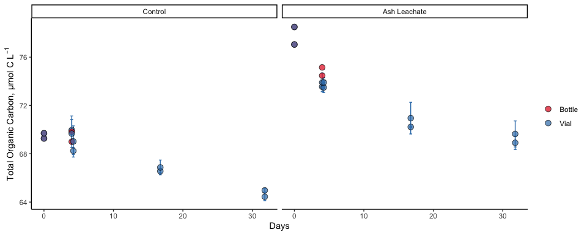
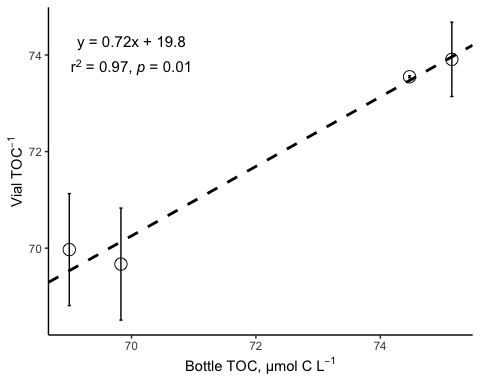
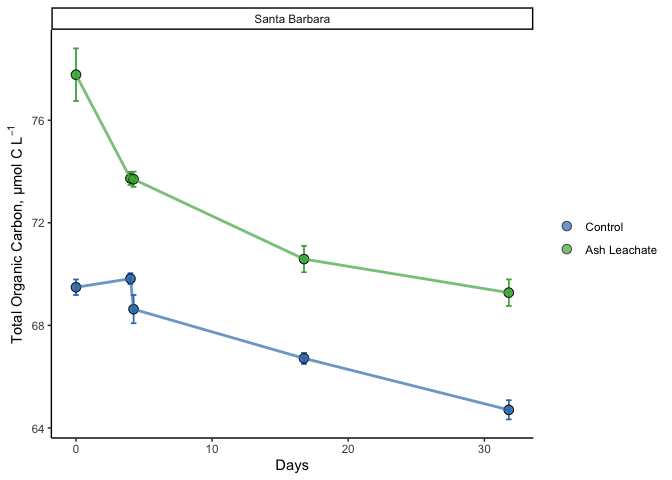
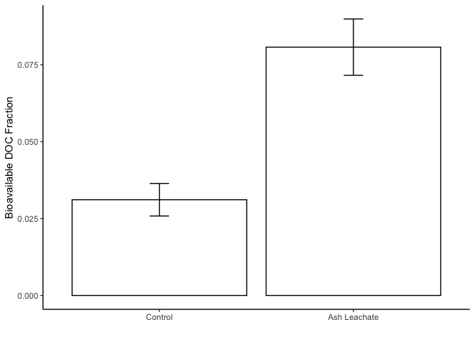
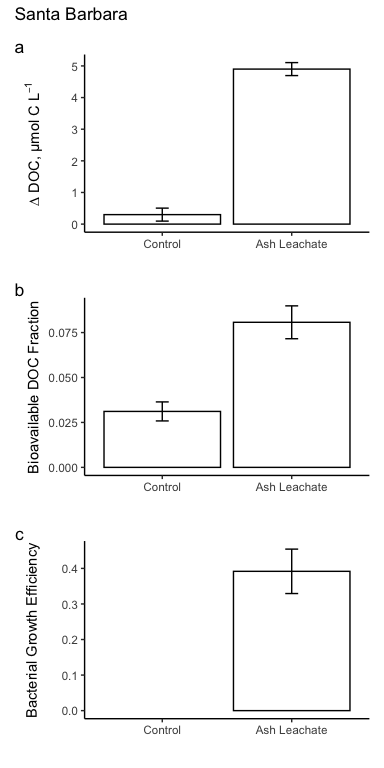

ACIDD\_TOC
================
Nicholas Baetge
8/28/2020

# Intro

This document shows how **individual bottle** DOC data from ACIDD
remineralization bioassays were processed, QC’d, and analyzed.

``` r
library(tidyverse) 
library(readxl)
library(lubridate)
```

# Import data

Just like the bacterial abundance data, the DOC data exists in two
separate sheets of an excel file. We’ll take a look at what is in those
sheets and combine the data using a “join”
function

``` r
excel_sheets("~/GITHUB/eemb144l/Input_Data/week4/ACIDD_Exp_TOC.xlsx") #let's see what the excel sheets are called
```

    ## [1] "Metadata" "Data"

``` r
metadata <- read_excel("~/GITHUB/eemb144l/Input_Data/week4/ACIDD_Exp_TOC.xlsx", sheet = "Metadata") #import the first sheet containing metadata
names(metadata)
```

    ##  [1] "Experiment"              "Location"               
    ##  [3] "Temperature_C"           "Depth"                  
    ##  [5] "Bottle"                  "Timepoint"              
    ##  [7] "Treatment"               "Target_DOC_Amendment_uM"
    ##  [9] "Inoculum_L"              "Media_L"                
    ## [11] "Datetime"                "TOC_Sample"             
    ## [13] "DOC_Sample"              "Parallel_Sample"        
    ## [15] "Cell_Sample"             "DNA_Sample"             
    ## [17] "Nutrient_Sample"         "DNA_SampleID"

``` r
data <- read_excel("~/GITHUB/eemb144l/Input_Data/week4/ACIDD_Exp_TOC.xlsx", sheet = "Data") #import the second sheet containing the cell abundances
names(data)
```

    ## [1] "Experiment" "Bottle"     "Timepoint"  "TOC"        "TOC_sd"    
    ## [6] "PTOC"       "PTOC_sd"

``` r
joined <- left_join(metadata, data)
```

    ## Joining, by = c("Experiment", "Bottle", "Timepoint")

``` r
names(joined)
```

    ##  [1] "Experiment"              "Location"               
    ##  [3] "Temperature_C"           "Depth"                  
    ##  [5] "Bottle"                  "Timepoint"              
    ##  [7] "Treatment"               "Target_DOC_Amendment_uM"
    ##  [9] "Inoculum_L"              "Media_L"                
    ## [11] "Datetime"                "TOC_Sample"             
    ## [13] "DOC_Sample"              "Parallel_Sample"        
    ## [15] "Cell_Sample"             "DNA_Sample"             
    ## [17] "Nutrient_Sample"         "DNA_SampleID"           
    ## [19] "TOC"                     "TOC_sd"                 
    ## [21] "PTOC"                    "PTOC_sd"

``` r
summary(joined)
```

    ##   Experiment          Location         Temperature_C     Depth  
    ##  Length:84          Length:84          Min.   :15    Min.   :5  
    ##  Class :character   Class :character   1st Qu.:15    1st Qu.:5  
    ##  Mode  :character   Mode  :character   Median :15    Median :5  
    ##                                        Mean   :15    Mean   :5  
    ##                                        3rd Qu.:15    3rd Qu.:5  
    ##                                        Max.   :15    Max.   :5  
    ##                                                                 
    ##     Bottle            Timepoint       Treatment         Target_DOC_Amendment_uM
    ##  Length:84          Min.   : 0.000   Length:84          Min.   : 0             
    ##  Class :character   1st Qu.: 2.000   Class :character   1st Qu.: 0             
    ##  Mode  :character   Median : 5.000   Mode  :character   Median : 5             
    ##                     Mean   : 4.762                      Mean   : 5             
    ##                     3rd Qu.: 7.000                      3rd Qu.:10             
    ##                     Max.   :10.000                      Max.   :10             
    ##                                                                                
    ##    Inoculum_L     Media_L    Datetime         TOC_Sample      DOC_Sample     
    ##  Min.   :1.5   Min.   :4   Length:84          Mode :logical   Mode :logical  
    ##  1st Qu.:1.5   1st Qu.:4   Class :character   FALSE:64        FALSE:48       
    ##  Median :1.5   Median :4   Mode  :character   TRUE :20        TRUE :36       
    ##  Mean   :1.5   Mean   :4                                                     
    ##  3rd Qu.:1.5   3rd Qu.:4                                                     
    ##  Max.   :1.5   Max.   :4                                                     
    ##                                                                              
    ##  Parallel_Sample Cell_Sample     DNA_Sample      Nutrient_Sample
    ##  Mode :logical   Mode :logical   Mode :logical   Mode :logical  
    ##  FALSE:44        FALSE:28        FALSE:68        FALSE:68       
    ##  TRUE :40        TRUE :56        TRUE :16        TRUE :16       
    ##                                                                 
    ##                                                                 
    ##                                                                 
    ##                                                                 
    ##  DNA_SampleID            TOC         TOC_sd             PTOC      
    ##  Length:84          Min.   :69.00   Mode:logical   Min.   :64.44  
    ##  Class :character   1st Qu.:69.59   NA's:84        1st Qu.:68.74  
    ##  Mode  :character   Median :72.15                  Median :69.69  
    ##                     Mean   :72.87                  Mean   :70.44  
    ##                     3rd Qu.:75.62                  3rd Qu.:73.50  
    ##                     Max.   :78.50                  Max.   :78.50  
    ##                     NA's   :76                     NA's   :64     
    ##     PTOC_sd      
    ##  Min.   :0.0200  
    ##  1st Qu.:0.2625  
    ##  Median :0.4850  
    ##  Mean   :0.6075  
    ##  3rd Qu.:1.1000  
    ##  Max.   :1.3100  
    ##  NA's   :68

``` r
View(joined)
```

    ## Warning in system2("/usr/bin/otool", c("-L", shQuote(DSO)), stdout = TRUE):
    ## running command ''/usr/bin/otool' -L '/Library/Frameworks/R.framework/Resources/
    ## modules/R_de.so'' had status 1

# Prepare data

Let’s convert the date and time column values from characters to dates,
add a column with the time elasped for each experiment (in days), and
then rearrange the columns.

``` r
toc <- joined %>% 
  mutate(Datetime = ymd_hm(Datetime)) %>% 
  group_by(Experiment, Bottle) %>% 
  mutate(interv = interval(first(Datetime), Datetime), 
         hours = interv/3600,
         days = hours/24) %>% 
  ungroup() %>% 
  rename(sd_TOC = TOC_sd,
         sd_PTOC = PTOC_sd) %>% 
  select(Experiment:Datetime, hours, days, everything(), -interv)
```

# Plot the curves

We have multiple organic carbon measurements: TOC and P(arallel) TOC.
We’ll plot all of them. We could plot each parameter separately, but
one thing we can do to streamline plotting is to first “lengthen” our
data (increase rows, decrease columns) using pivot\_longer().

**We only have data for the Santa Barbara experiments, so we’ll filter
out the San Diego experiments for now**

## Pivot data

``` r
pivot_toc <- toc %>% 
  select(Experiment, Location, Bottle, Treatment, days, TOC, PTOC ) %>% 
  pivot_longer(TOC:PTOC, names_to = "sample", values_to = "value")

pivot_toc_sd <- toc %>% 
  select(Experiment, Location, Bottle, Treatment, days, sd_TOC, sd_PTOC) %>% 
  pivot_longer(sd_TOC:sd_PTOC, names_to = "sample", names_prefix = "sd_", values_to = "sd")

pivoted <- left_join(pivot_toc, pivot_toc_sd) %>% 
  mutate(sample = ifelse(sample == "TOC", "Bottle", "Vial"))
```

    ## Joining, by = c("Experiment", "Location", "Bottle", "Treatment", "days", "sample")

``` r
View(pivoted)
```

    ## Warning in system2("/usr/bin/otool", c("-L", shQuote(DSO)), stdout = TRUE):
    ## running command ''/usr/bin/otool' -L '/Library/Frameworks/R.framework/Resources/
    ## modules/R_de.so'' had status 1

## Plot

``` r
custom.colors <- c("Control" = "#377EB8", "Ash Leachate" = "#4DAF4A", "Santa Barbara" = "#E41A1C", "San Diego" = "#FF7F00", "Vial" = "#377EB8", "Bottle" = "#E41A1C")
levels <- c("Control", "Ash Leachate", "San Diego", "Santa Barbara", "Bottle", "Vial")

pivoted %>% 
  filter(Location == "Santa Barbara") %>% 
  drop_na(value) %>% 
  ggplot(aes(x = days, y = value, group = interaction(Experiment, Treatment, Bottle)) ) + 
  geom_errorbar(aes(ymin = value - sd, ymax = value + sd, color = factor(sample, levels = levels)), width = 0.4) +
  geom_point(aes(fill = factor(sample, levels = levels)), size = 3, shape = 21, alpha = 0.7 ) +
  scale_color_manual(values = custom.colors) +
  scale_fill_manual(values = custom.colors) +
  labs(x = "Days", y = expression(paste("Total Organic Carbon, µmol C L"^-1))) +
  theme_classic() +
  facet_grid(~factor(Treatment, levels = levels), scales = "free") +
  theme(legend.title = element_blank()) +
  guides(color = F)
```



# TOC v PTOC

Let’s do a simple regression comparing TOC and PTOC samples. There will
be only 4 points here, but this may be a useful exercise for your data.

    ## RMA was not requested: it will not be computed.

    ## 
    ## Model II regression
    ## 
    ## Call: lmodel2(formula = PTOC ~ TOC, data = reg.data, nperm = 99)
    ## 
    ## n = 4   r = 0.9866202   r-square = 0.9734195 
    ## Parametric P-values:   2-tailed = 0.01337976    1-tailed = 0.006689882 
    ## Angle between the two OLS regression lines = 0.7319938 degrees
    ## 
    ## Permutation tests of OLS, MA, RMA slopes: 1-tailed, tail corresponding to sign
    ## A permutation test of r is equivalent to a permutation test of the OLS slope
    ## P-perm for SMA = NA because the SMA slope cannot be tested
    ## 
    ## Regression results
    ##   Method Intercept     Slope Angle (degrees) P-perm (1-tailed)
    ## 1    OLS  20.53052 0.7106186        35.39831              0.14
    ## 2     MA  20.05813 0.7171693        35.64693              0.14
    ## 3    SMA  19.83558 0.7202554        35.76352                NA
    ## 
    ## Confidence intervals
    ##   Method 2.5%-Intercept 97.5%-Intercept 2.5%-Slope 97.5%-Slope
    ## 1    OLS      -5.251071        46.31211  0.3533544    1.067883
    ## 2     MA     -12.423031        42.82588  0.4014438    1.167593
    ## 3    SMA     -11.966197        39.56023  0.4467293    1.161258
    ## 
    ## Eigenvalues: 14.93615 0.09037159 
    ## 
    ## H statistic used for computing C.I. of MA: 0.05669009

``` r
reg.data %>% 
  ggplot(aes(x = TOC, y = PTOC)) + 
  geom_abline(intercept = reg$regression.results[3,2],
              slope = reg$regression.results[3,3],colour = "black", linetype = 2, size = 1) +
   geom_abline(intercept = reg$confidence.intervals[3,2],
              slope = reg$confidence.intervals[3,4],colour = "grey", linetype = 3, size = 1) +
  geom_abline(intercept = reg$confidence.intervals[3,3],
              slope = reg$confidence.intervals[3,5],colour = "grey", linetype = 3, size = 1) +
  geom_errorbar(aes(ymin = PTOC - sd_PTOC, ymax = PTOC + sd_PTOC), width = 0.05) +
  #geom_errorbarh(aes(xmin = TOC - sd_TOC, xmax = TOC + sd_TOC), height = 0.01) +
  geom_point( shape = 21, color = "black", size = 4, alpha = 1) +
  labs(x = expression(paste("Bottle TOC, µmol C L"^-1)), y = expression(paste("Vial TOC"^-1))) +
  theme_classic() +
  annotate( geom = "text", label = expression(atop("y = 0.72x + 19.8", paste("r"^2," = 0.97, ", italic("p "), "= 0.01"))), x = 70, y = 74, size = 4) 
```

    ## Warning in is.na(x): is.na() applied to non-(list or vector) of type
    ## 'expression'



The vial and bottle TOC samples are not significantly different from one
another and in fact, the difference in the measured values are within
analytical detection limit for our method (1.5 µmol C L<sup>-1</sup>).

We can move forward with our analysis using the vial TOC values, since
the dataset for those samples are more complete.

# Merge bacterial carbon data

We’re particulary interested in DOC, the substrate used by
bacterioplankton. We can calculate DOC as the difference between TOC and
bacterial carbon. To do so, we’ll need to merge this dataset with the
processed bacterial abundance
dataset.

``` r
bc <- read_rds("~/GITHUB/eemb144l/Output_Data/week3/ACIDD_Exp_Processed_BactAbund.rds")

merge <- full_join(bc, toc) %>% 
  arrange(Experiment, Bottle, Timepoint) %>% 
  fill(exp_start:delta_cells, delta_bc:sd_lag) #fill the values for variables that are the same for every timepoint of every treatment
```

    ## Joining, by = c("Experiment", "Location", "Temperature_C", "Depth", "Bottle", "Timepoint", "Treatment", "Target_DOC_Amendment_uM", "Inoculum_L", "Media_L", "Datetime", "TOC_Sample", "DOC_Sample", "Parallel_Sample", "Cell_Sample", "DNA_Sample", "Nutrient_Sample", "hours", "days")

Ok, so we don’t have a TOC sample for every timepoint in which we
sampled bacterial abundance and vice-versa. Before we move forward,
let’s first linearly interpolate the TOC and bacterial carbon data.

# Interpolate

To interpolate NA observations, we’ll use the zoo() and na.approx()
functions in the package zoo.

``` r
library(zoo)
```

    ## 
    ## Attaching package: 'zoo'

    ## The following objects are masked from 'package:base':
    ## 
    ##     as.Date, as.Date.numeric

We only want to interpolate within an experiment and not across
experiments, so we’ll perform the interpolation by using the
split-apply-combine strategy. We’ll:

  - split the dataframe into a list of its elements (in this case,
    experiments and bottles)
  - apply the interpolation function to each of the list elements
  - combine the results into a new dataframe

## Split

``` r
to_interpolate <- merge %>%  
  select(Experiment, Bottle, Timepoint, days, PTOC, bc) %>% 
  group_by(Experiment, Bottle)  # first we'll define the grouping of our dataframe

list <- to_interpolate %>%
  group_split() #then we can convert the dataframe into a list, broken up by the groups (list elements)

#notice that the list elements don't have names. we can add those ourselves
keys <- to_interpolate %>% 
  group_keys() %>%
  mutate(key = paste(Experiment, Bottle))
header <- keys$key

names(list) <- header
```

## Write the function

``` r
interp.func <- function(x) {
  y <- zoo(x, order.by = x$days) #orders our observations
  interp_toc <- round(as.numeric(na.approx(y$PTOC, na.rm = F)), 1) #interpolate doc
  interp_bc <- round(as.numeric(na.approx(y$bc, na.rm = F)), 1) #interpolate bc
  z <- cbind(y, interp_toc, interp_bc) #combine the columns 
  as_tibble(z) #convert to dataframe
}
```

## Apply and Combine

``` r
interpolated <- lapply(list, interp.func) %>% 
  plyr::ldply(., as.data.frame) %>% 
  select(-c(.id, PTOC, bc, days)) %>% 
  mutate_at(vars(Timepoint:interp_bc), as.numeric) %>% 
  left_join(merge, .)
```

    ## Joining, by = c("Experiment", "Bottle", "Timepoint")

# Estimate DOC, Bioavailability, BGEs

``` r
doc <- interpolated %>% 
  mutate(doc = interp_toc - interp_bc) %>% 
  group_by(Experiment, Bottle) %>%
  mutate(bioav_doc = (first(doc) - last(na.omit(doc))) / first(doc),
         doc_exp_end = ifelse(Timepoint == exp_end, doc, NA),
         delta_doc = first(doc) - doc_exp_end,
         bge = ifelse(delta_doc > 1.5, delta_bc/delta_doc, NA)) %>% 
  fill(doc_exp_end:bge, .direction = "downup") %>% 
  ungroup()
```

# Calculate treatment averages

``` r
averages <- doc %>%
  group_by(Experiment, Treatment, Timepoint) %>% 
  mutate(ave_toc = mean(PTOC),
         sd_toc = sd(PTOC)) %>% 
  ungroup() %>% 
  group_by(Experiment, Treatment) %>% 
  mutate(ave_bioav_doc = mean(bioav_doc),
         sd_bioav_doc = sd(bioav_doc),
         ave_delta_doc = mean(delta_doc),
         sd_delta_doc = sd(delta_doc),
         ave_bge = mean(bge),
         sd_bge = sd(bge)) %>% 
  ungroup()
```

# Plot treament curves

``` r
averages %>% 
  filter(Location == "Santa Barbara") %>% 
  drop_na(ave_toc) %>% 
  ggplot(aes(x = days, y = ave_toc, group = interaction(Experiment, Treatment)) ) + 
  geom_errorbar(aes(ymin = ave_toc - sd_toc, ymax = ave_toc + sd_toc, color = factor(Treatment, levels = levels)), width = 0.4) +
  geom_point(aes(fill = factor(Treatment, levels = levels)), size = 3, shape = 21, alpha = 0.7 ) +
   geom_line(aes(color = factor(Treatment, levels = levels)), size = 1, alpha = 0.7 ) +
  scale_color_manual(values = custom.colors) +
  scale_fill_manual(values = custom.colors) +
  labs(x = "Days", y = expression(paste("Total Organic Carbon, µmol C L"^-1))) +
  theme_classic() +
  facet_grid(~factor(Location, levels = levels), scales = "free") +
  theme(legend.title = element_blank()) +
  guides(color = F)
```

<!-- -->

# Plot treatment averages

``` r
bar.data <- averages %>% 
  select(Location, Treatment, ave_bioav_doc:sd_bge) %>% 
  distinct() %>% 
  filter(Location == "Santa Barbara")
```

``` r
bioav <- bar.data %>% 
ggplot(aes(x = factor(Treatment, levels = levels), y =  ave_bioav_doc, group = interaction(Location, Treatment)))  + 
  geom_bar(position = position_dodge(), stat = "identity", color = "black", fill = "white", alpha = 1) +
  geom_errorbar(aes(ymin = ave_bioav_doc - sd_bioav_doc, ymax = ave_bioav_doc + sd_bioav_doc), position = position_dodge(width = 0.9), stat = "identity", width = 0.1, size = 0.5) +
  labs(x = "", y = expression(paste("Bioavailable DOC Fraction")), color = "") +
  theme_classic() +
  #facet_grid(~factor(Location, levels = levels), scales = "free") +
  guides(fill = F) 

bioav
```

<!-- -->

``` r
deldoc <- bar.data %>% 
ggplot(aes(x = factor(Treatment, levels = levels), y =  ave_delta_doc, group = interaction(Location, Treatment)))  + 
  geom_bar(position = position_dodge(), stat = "identity", color = "black", fill = "white", alpha = 1) +
  geom_errorbar(aes(ymin = ave_delta_doc - sd_delta_doc, ymax = ave_delta_doc + sd_delta_doc), position = position_dodge(width = 0.9), stat = "identity", width = 0.1, size = 0.5) +
  labs(x = "", y = expression(paste("∆ DOC, µmol C L"^-1)), color = "") +
  theme_classic() +
  #facet_grid(~factor(Location, levels = levels), scales = "free") +
  guides(fill = F) 
```

``` r
bge <- bar.data %>% 
ggplot(aes(x = factor(Treatment, levels = levels), y =  ave_bge, group = interaction(Location, Treatment)))  + 
  geom_bar(position = position_dodge(), stat = "identity", color = "black", fill = "white", alpha = 1) +
  geom_errorbar(aes(ymin = ave_bge - sd_bge, ymax = ave_bge + sd_bge), position = position_dodge(width = 0.9), stat = "identity", width = 0.1, size = 0.5) +
  labs(x = "", y = expression(paste("Bacterial Growth Efficiency")), color = "") +
  theme_classic() +
  #facet_grid(~factor(Location, levels = levels), scales = "free") +
  guides(fill = F) 
```

``` r
library(patchwork)
```

``` r
deldoc / bioav / bge  + plot_annotation(title = "Santa Barbara", tag_levels = "a")
```

    ## Warning: Removed 1 rows containing missing values (geom_bar).

<!-- -->

# Save Data

``` r
saveRDS(averages, "~/GITHUB/eemb144l/Output_Data/week4/ACIDD_Exp_Processed_DOC_BGE.rds")
```
