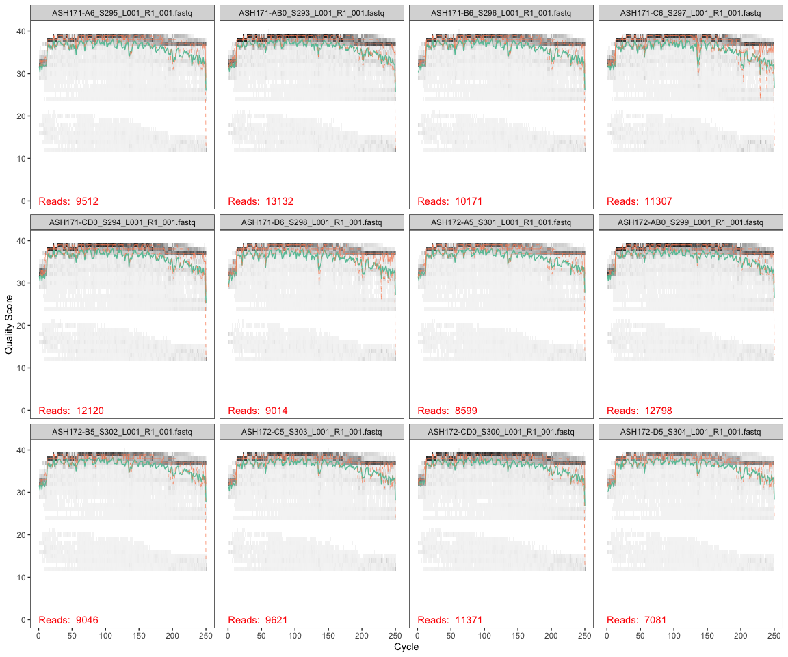
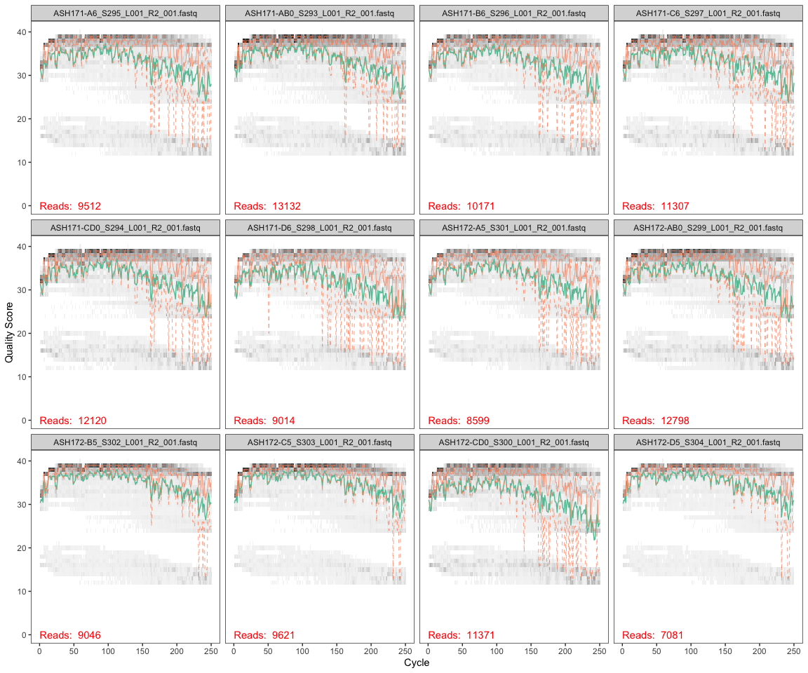
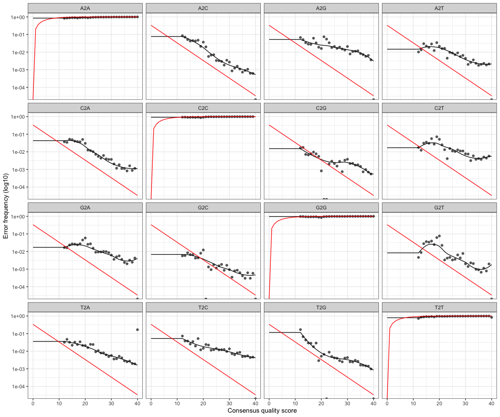
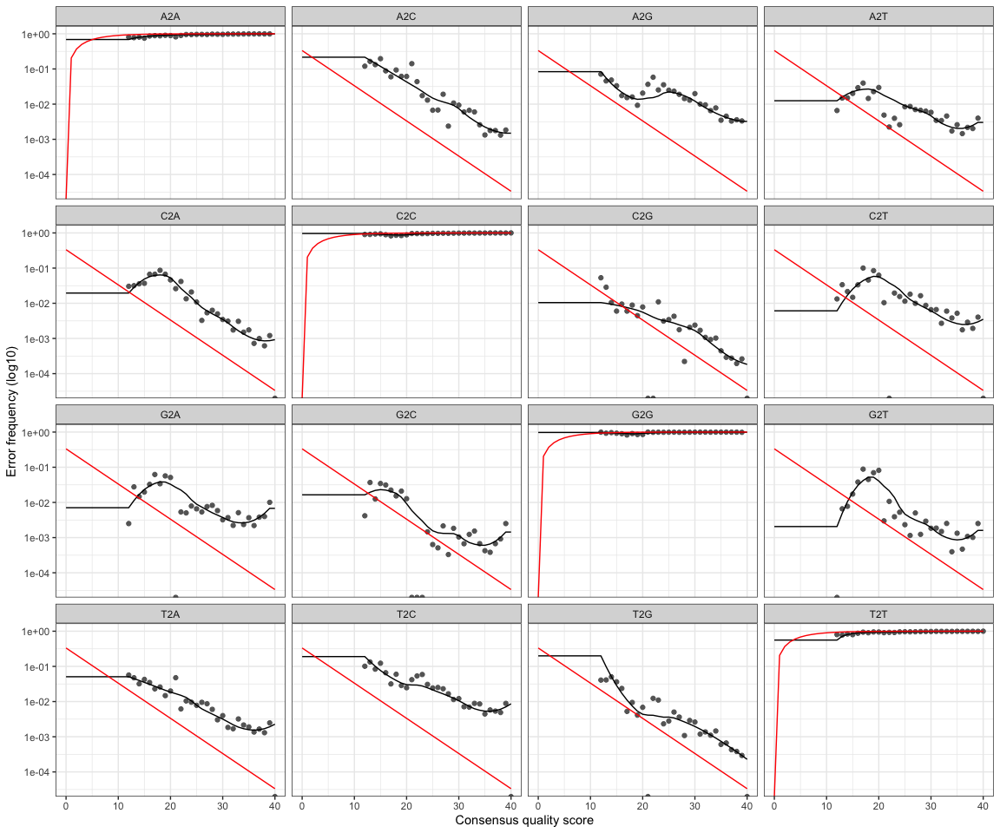

DADA2
================
Nicholas Baetge
6/23/2020

This script processes trimmed (w/o primers) sequences through the [DADA2
(1.6) pipeline](https://benjjneb.github.io/dada2/tutorial.html)

# Install DADA2 from Bioconductor

``` r
# if (!requireNamespace("BiocManager", quietly = TRUE))
#     install.packages("BiocManager")
# BiocManager::install("dada2", version = "3.11")
```

# Load packages

``` r
library(tidyverse)
library(dada2)
library(ShortRead)
```

# Import data

You will need to download your sequences from the [shared google
drive](https://drive.google.com/drive/u/1/folders/0ADL8pGXbFSNnUk9PVA)
to a folder in your repository. Because this folder will then contain a
lot of data (over the limit for pushing to the GitHub server), you’ll
want to have your commits ignore the addition and any changes to that
folder. THIS IS IMPORTANT. You can modify the .gitignore file in your
repository by:

  - revealing hidden files (command + shift + . on a mac and in
    [windows](https://support.microsoft.com/en-us/help/4028316/windows-view-hidden-files-and-folders-in-windows-10),
    open *file explorer*, select *view \> options \> change folder* and
    *search options*, select *view* and in *advanced setting*, select
    *show hidden files, folders, and drives* )
  - open the .gitignore file (textedit on a mac and notepad in widows)
  - add the name of the folder containing the fastq (sequence) files to
    the .gitignore file, save, and
close

<!-- end list -->

``` r
#save the path to the directory with a COPY of your unzipped fastq files that you will work with. MAKE SURE YOU HAVE ANOTHER DIRECTORY WITH THE FILES THAT YOU WILL NEVER DIRECTLY WORK WITH. 
path <- "~/GITHUB/eemb144l/Input_Data/week5/ACIDD_Remin_fastq" #make sure there isn't a "/" at the end of the path
#also make sure that there are no unzipped files here

#paths for filtering script - change these to where your raw reads are
pathF <- path # see above^
pathR <- path # see above^

#store names of forward and reverse files as lists
fnFs <- sort(list.files(path, pattern = "_R1_001.fastq", full.names = TRUE))
fnRs <- sort(list.files(path, pattern = "_R2_001.fastq", full.names = TRUE))
```

# Retrieve orientation of primers

This part stores all the orientations of the V4 514F-Y and 806RB primers
( [see Apprill et
al., 2015](http://www.int-res.com/articles/ame_oa/a075p129.pdf)), so
that we can look for them when we want to trim them out

``` r
#store the  forward and reverse primers
FWD = "GTGYCAGCMGCCGCGGTAA"
REV = "GGACTACNVGGGTWTCTAAT"

#now store all the orientations of your forward and reverse  primers
allOrients <- function(primer) {
  # The Biostrings works w/ DNAString objects rather than character vectors
  require(Biostrings)
  dna <- DNAString(primer) 
  orients <- c(Forward = dna, Complement = complement(dna), Reverse = reverse(dna), 
               RevComp = reverseComplement(dna))
  # Convert back to character vector
  return(sapply(orients, toString))  
}

#store the fwd and reverse oreintations separately
FWD.orients <- allOrients(FWD)
REV.orients <- allOrients(REV)

#view the orientations of the primers
FWD.orients
```

    ##               Forward            Complement               Reverse 
    ## "GTGYCAGCMGCCGCGGTAA" "CACRGTCGKCGGCGCCATT" "AATGGCGCCGMCGACYGTG" 
    ##               RevComp 
    ## "TTACCGCGGCKGCTGRCAC"

``` r
REV.orients
```

    ##                Forward             Complement                Reverse 
    ## "GGACTACNVGGGTWTCTAAT" "CCTGATGNBCCCAWAGATTA" "TAATCTWTGGGVNCATCAGG" 
    ##                RevComp 
    ## "ATTAGAWACCCBNGTAGTCC"

# Filter out all sequences with ambiguous base calls

This part looks at the raw sequencing reads and removes reads with
[ambiguous base calls
(i.e. N)](https://www.bioinformatics.org/sms/iupac.html). The
subsequent workflow can’t filter out primers properly if reads have “N”
bases in them.

``` r
# Put N-filtered files in filtN/ subdirectory
fnFs.filtN <- file.path(path, "filtN", basename(fnFs)) 
fnRs.filtN <- file.path(path, "filtN", basename(fnRs))

#filter out any reads that contain "N" in the sequence (search IUPAC ambiguity codes for descriptions)
filterAndTrim(fwd = file.path(fnFs), filt = fnFs.filtN, rev = file.path(fnRs), filt.rev = fnRs.filtN, maxN = 0)
```

# Remove primers

This part searches for primers in all the orientations and removes them
from all the remaining filtered sequences

``` r
primerHits <- function(primer, fn) {
  # Counts number of reads in which the primer is found
  nhits <- vcountPattern(primer, sread(readFastq(fn)), fixed = FALSE)
  return(sum(nhits > 0))
}

rbind(FWD.ForwardReads = sapply(FWD.orients, primerHits, fn = fnFs.filtN[[1]]), 
      FWD.ReverseReads = sapply(FWD.orients, primerHits, fn = fnRs.filtN[[1]]), 
      REV.ForwardReads = sapply(REV.orients, primerHits, fn = fnFs.filtN[[1]]), 
      REV.ReverseReads = sapply(REV.orients, primerHits, fn = fnRs.filtN[[1]]))
```

    ##                  Forward Complement Reverse RevComp
    ## FWD.ForwardReads       0          0       0       0
    ## FWD.ReverseReads       0          0       0       2
    ## REV.ForwardReads       0          0       0       3
    ## REV.ReverseReads       0          0       0       0

At this point a 4X4 table is returned. If all the numbers are 0, then
you don’t have primers in your sequences :) If they have numbers, use
cutadapt to remove the primers, appropriately. If there are only hits of
the reverse complement in the FWD.ReverseReads and the REV.ForwardReads,
that is ok - it indicates that the reads are long enough to get the
primers on the end. We can trim those out with the MergePairs function
later, by adding trimOverhang=T.

# Inspect read quality profiles

You should look at least some of the quality profiles to assess the
quality of the sequencing run. Typically, the reverse reads will often
be poorer quality than the forward reads, particular at the ends. Use
this information to decide where to uniformly trim your reads. If you
have low quality scores throughout the reads, then you may want to
resequence your
samples

## Forward reads



In gray-scale is a heat map of the frequency of each quality score at
each base position. The mean quality score at each position is shown by
the green line, and the quartiles of the quality score distribution by
the orange lines.

The DADA2 Tutorial advises trimming the last few nucleotides to avoid
less well-controlled errors that can arise there. These quality profiles
do not suggest that any additional trimming is needed. We will truncate
the forward reads at position 240 (trimming the last 10
nucleotides).

## Reverse reads



The reverse reads are of significantly worse quality, especially at the
end, which is common in Illumina sequencing. This isn’t too worrisome,
as DADA2 incorporates quality information into its error model which
makes the algorithm robust to lower quality sequence, but trimming as
the average qualities crash will improve the algorithm’s sensitivity to
rare sequence variants. Based on these profiles, we will truncate the
reverse reads at position 150 where the quality distribution crashes.

# Filtering and Trimming

``` r
#Get the sample names
#define the basename of the FnFs as the first part of each fastQ file name until "_L"
#apply this to all samples
sample.names <- sapply(strsplit(basename(fnFs),"_L"), `[`,1)
sample.names
```

    ##  [1] "ASH171-A0_S293" "ASH171-A6_S295" "ASH171-B0_S293" "ASH171-B6_S296"
    ##  [5] "ASH171-C0_S294" "ASH171-C6_S297" "ASH171-D0_S294" "ASH171-D6_S298"
    ##  [9] "ASH172-A0_S299" "ASH172-A5_S301" "ASH172-B0_S299" "ASH172-B5_S302"
    ## [13] "ASH172-C0_S300" "ASH172-C5_S303" "ASH172-D0_S300" "ASH172-D5_S304"

``` r
#create a "filtered" folder in the working directory as a place to put all the new filtered fastQ files
filt_path <- file.path(path,"filtered")

#add the appropriate designation string to any new files made that will be put into the "filtered" folder
filtFs <- file.path(filt_path, paste0(sample.names, "_F_filt.fastq"))
filtRs <- file.path(filt_path, paste0(sample.names, "_R_filt.fastq"))
```

Below is the actual filtering step. We’re using standard filtering
parameters. 1. dada2 generally advises trimming last few nucleotides for
weird sequencing errors that can pop up there. 2. maxEE is the max
number of expected errors (calc’ed from Q’s) to allow in each read. This
is a probability calculation. 3. minQ is a threshold Q - and read with a
Q \< minQ after truncating reads gets discarded. This isn’t that
important for
16/18S

``` r
out <- filterAndTrim(fnFs, filtFs, fnRs, filtRs, truncLen = c(240,150),  maxN = 0, maxEE = c(2,2), truncQ = 2, rm.phix = TRUE, compress = TRUE) 

#look at the output. this tells you how many reads were removed. 
readsinout <- out
```

# Learn the error rates

The dada2 algorithm makes use of a parametric error model (err) as every
amplicon dataset has a different set of error rates. This is what dada2
is all about. This step creates the parameters for designating unique
sequences.

Each sequence has an x number of reads. dada2 uses the numbers of reads
per sequence as well as the q-score to build this model. This algorithm
assumes that your most abundant sequence is real. There is a very high
probability that it is.

What the algorithim does that looks at each base pair of an individul
sequence and calculates the probabilty that the base pair is an error
based on the quality score of the read and the sequence of your most
abundant read. It also does this for the second most abundant sequence,
etc etc. hence the message “convergence after x rounds” after running
the
    algorithm.

``` r
errF <- learnErrors(filtFs, multithread = TRUE)
```

    ## 38678400 total bases in 161160 reads from 16 samples will be used for learning the error rates.

``` r
errR <- learnErrors(filtRs, multithread = TRUE)
```

    ## 24174000 total bases in 161160 reads from 16 samples will be used for learning the error rates.

This took ~40s to run on a 2020 Macbook
Pro





The error rates for each possible transition (A→C, A→G, …) are shown.
Points are the observed error rates for each consensus quality score.
The black line shows the estimated error rates after convergence of the
machine-learning algorithm. The red line shows the error rates expected
under the nominal definition of the Q-score. Here the estimated error
rates (black line) are a good fit to the observed rates (points), and
the error rates drop with increased quality as expected. Everything
looks reasonable and we proceed with confidence.

# Dereplication

This is another big thing that dada2 does. It combines all identical
sequences into one unique sequence, keeping track of the number of
identical
    sequences.

``` r
derepFs <- derepFastq(filtFs, verbose = TRUE)
```

    ## Dereplicating sequence entries in Fastq file: ~/GITHUB/eemb144l/Input_Data/week5/ACIDD_Remin_fastq/filtered/ASH171-A0_S293_F_filt.fastq

    ## Encountered 7405 unique sequences from 12306 total sequences read.

    ## Dereplicating sequence entries in Fastq file: ~/GITHUB/eemb144l/Input_Data/week5/ACIDD_Remin_fastq/filtered/ASH171-A6_S295_F_filt.fastq

    ## Encountered 5227 unique sequences from 8807 total sequences read.

    ## Dereplicating sequence entries in Fastq file: ~/GITHUB/eemb144l/Input_Data/week5/ACIDD_Remin_fastq/filtered/ASH171-B0_S293_F_filt.fastq

    ## Encountered 7405 unique sequences from 12306 total sequences read.

    ## Dereplicating sequence entries in Fastq file: ~/GITHUB/eemb144l/Input_Data/week5/ACIDD_Remin_fastq/filtered/ASH171-B6_S296_F_filt.fastq

    ## Encountered 5556 unique sequences from 9494 total sequences read.

    ## Dereplicating sequence entries in Fastq file: ~/GITHUB/eemb144l/Input_Data/week5/ACIDD_Remin_fastq/filtered/ASH171-C0_S294_F_filt.fastq

    ## Encountered 6358 unique sequences from 11231 total sequences read.

    ## Dereplicating sequence entries in Fastq file: ~/GITHUB/eemb144l/Input_Data/week5/ACIDD_Remin_fastq/filtered/ASH171-C6_S297_F_filt.fastq

    ## Encountered 5448 unique sequences from 10310 total sequences read.

    ## Dereplicating sequence entries in Fastq file: ~/GITHUB/eemb144l/Input_Data/week5/ACIDD_Remin_fastq/filtered/ASH171-D0_S294_F_filt.fastq

    ## Encountered 6358 unique sequences from 11231 total sequences read.

    ## Dereplicating sequence entries in Fastq file: ~/GITHUB/eemb144l/Input_Data/week5/ACIDD_Remin_fastq/filtered/ASH171-D6_S298_F_filt.fastq

    ## Encountered 4235 unique sequences from 8211 total sequences read.

    ## Dereplicating sequence entries in Fastq file: ~/GITHUB/eemb144l/Input_Data/week5/ACIDD_Remin_fastq/filtered/ASH172-A0_S299_F_filt.fastq

    ## Encountered 7240 unique sequences from 11824 total sequences read.

    ## Dereplicating sequence entries in Fastq file: ~/GITHUB/eemb144l/Input_Data/week5/ACIDD_Remin_fastq/filtered/ASH172-A5_S301_F_filt.fastq

    ## Encountered 4816 unique sequences from 7988 total sequences read.

    ## Dereplicating sequence entries in Fastq file: ~/GITHUB/eemb144l/Input_Data/week5/ACIDD_Remin_fastq/filtered/ASH172-B0_S299_F_filt.fastq

    ## Encountered 7240 unique sequences from 11824 total sequences read.

    ## Dereplicating sequence entries in Fastq file: ~/GITHUB/eemb144l/Input_Data/week5/ACIDD_Remin_fastq/filtered/ASH172-B5_S302_F_filt.fastq

    ## Encountered 4735 unique sequences from 8624 total sequences read.

    ## Dereplicating sequence entries in Fastq file: ~/GITHUB/eemb144l/Input_Data/week5/ACIDD_Remin_fastq/filtered/ASH172-C0_S300_F_filt.fastq

    ## Encountered 6642 unique sequences from 10559 total sequences read.

    ## Dereplicating sequence entries in Fastq file: ~/GITHUB/eemb144l/Input_Data/week5/ACIDD_Remin_fastq/filtered/ASH172-C5_S303_F_filt.fastq

    ## Encountered 4862 unique sequences from 9127 total sequences read.

    ## Dereplicating sequence entries in Fastq file: ~/GITHUB/eemb144l/Input_Data/week5/ACIDD_Remin_fastq/filtered/ASH172-D0_S300_F_filt.fastq

    ## Encountered 6642 unique sequences from 10559 total sequences read.

    ## Dereplicating sequence entries in Fastq file: ~/GITHUB/eemb144l/Input_Data/week5/ACIDD_Remin_fastq/filtered/ASH172-D5_S304_F_filt.fastq

    ## Encountered 3657 unique sequences from 6759 total sequences read.

``` r
derepRs <- derepFastq(filtRs, verbose = TRUE)
```

    ## Dereplicating sequence entries in Fastq file: ~/GITHUB/eemb144l/Input_Data/week5/ACIDD_Remin_fastq/filtered/ASH171-A0_S293_R_filt.fastq

    ## Encountered 6257 unique sequences from 12306 total sequences read.

    ## Dereplicating sequence entries in Fastq file: ~/GITHUB/eemb144l/Input_Data/week5/ACIDD_Remin_fastq/filtered/ASH171-A6_S295_R_filt.fastq

    ## Encountered 4706 unique sequences from 8807 total sequences read.

    ## Dereplicating sequence entries in Fastq file: ~/GITHUB/eemb144l/Input_Data/week5/ACIDD_Remin_fastq/filtered/ASH171-B0_S293_R_filt.fastq

    ## Encountered 6257 unique sequences from 12306 total sequences read.

    ## Dereplicating sequence entries in Fastq file: ~/GITHUB/eemb144l/Input_Data/week5/ACIDD_Remin_fastq/filtered/ASH171-B6_S296_R_filt.fastq

    ## Encountered 5092 unique sequences from 9494 total sequences read.

    ## Dereplicating sequence entries in Fastq file: ~/GITHUB/eemb144l/Input_Data/week5/ACIDD_Remin_fastq/filtered/ASH171-C0_S294_R_filt.fastq

    ## Encountered 5887 unique sequences from 11231 total sequences read.

    ## Dereplicating sequence entries in Fastq file: ~/GITHUB/eemb144l/Input_Data/week5/ACIDD_Remin_fastq/filtered/ASH171-C6_S297_R_filt.fastq

    ## Encountered 4891 unique sequences from 10310 total sequences read.

    ## Dereplicating sequence entries in Fastq file: ~/GITHUB/eemb144l/Input_Data/week5/ACIDD_Remin_fastq/filtered/ASH171-D0_S294_R_filt.fastq

    ## Encountered 5887 unique sequences from 11231 total sequences read.

    ## Dereplicating sequence entries in Fastq file: ~/GITHUB/eemb144l/Input_Data/week5/ACIDD_Remin_fastq/filtered/ASH171-D6_S298_R_filt.fastq

    ## Encountered 4353 unique sequences from 8211 total sequences read.

    ## Dereplicating sequence entries in Fastq file: ~/GITHUB/eemb144l/Input_Data/week5/ACIDD_Remin_fastq/filtered/ASH172-A0_S299_R_filt.fastq

    ## Encountered 6844 unique sequences from 11824 total sequences read.

    ## Dereplicating sequence entries in Fastq file: ~/GITHUB/eemb144l/Input_Data/week5/ACIDD_Remin_fastq/filtered/ASH172-A5_S301_R_filt.fastq

    ## Encountered 4617 unique sequences from 7988 total sequences read.

    ## Dereplicating sequence entries in Fastq file: ~/GITHUB/eemb144l/Input_Data/week5/ACIDD_Remin_fastq/filtered/ASH172-B0_S299_R_filt.fastq

    ## Encountered 6844 unique sequences from 11824 total sequences read.

    ## Dereplicating sequence entries in Fastq file: ~/GITHUB/eemb144l/Input_Data/week5/ACIDD_Remin_fastq/filtered/ASH172-B5_S302_R_filt.fastq

    ## Encountered 3596 unique sequences from 8624 total sequences read.

    ## Dereplicating sequence entries in Fastq file: ~/GITHUB/eemb144l/Input_Data/week5/ACIDD_Remin_fastq/filtered/ASH172-C0_S300_R_filt.fastq

    ## Encountered 6625 unique sequences from 10559 total sequences read.

    ## Dereplicating sequence entries in Fastq file: ~/GITHUB/eemb144l/Input_Data/week5/ACIDD_Remin_fastq/filtered/ASH172-C5_S303_R_filt.fastq

    ## Encountered 3582 unique sequences from 9127 total sequences read.

    ## Dereplicating sequence entries in Fastq file: ~/GITHUB/eemb144l/Input_Data/week5/ACIDD_Remin_fastq/filtered/ASH172-D0_S300_R_filt.fastq

    ## Encountered 6625 unique sequences from 10559 total sequences read.

    ## Dereplicating sequence entries in Fastq file: ~/GITHUB/eemb144l/Input_Data/week5/ACIDD_Remin_fastq/filtered/ASH172-D5_S304_R_filt.fastq

    ## Encountered 2688 unique sequences from 6759 total sequences read.

``` r
# Name the derep-class objects by the sample names
names(derepFs) <- sample.names
names(derepRs) <- sample.names
```

This took ~5s on a 2020 Macbook Pro

# Infer the sequence variants

Apply the core dada2 sample inference algorithm to the dereplicated
data.

Infer the sequence variants in each sample, taking out the sequence
variants that have excessive error rates.

So here, we are applying the error models to the data. Before, the error
models were run using a subset of the data (parameterizing). Now, we’re
using the parameters of the model and applying it to the whole data set
to see which sequences are real and which are not.

``` r
dadaFs <- dada(derepFs, err = errF, multithread = TRUE)
```

    ## Sample 1 - 12306 reads in 7405 unique sequences.
    ## Sample 2 - 8807 reads in 5227 unique sequences.
    ## Sample 3 - 12306 reads in 7405 unique sequences.
    ## Sample 4 - 9494 reads in 5556 unique sequences.
    ## Sample 5 - 11231 reads in 6358 unique sequences.
    ## Sample 6 - 10310 reads in 5448 unique sequences.
    ## Sample 7 - 11231 reads in 6358 unique sequences.
    ## Sample 8 - 8211 reads in 4235 unique sequences.
    ## Sample 9 - 11824 reads in 7240 unique sequences.
    ## Sample 10 - 7988 reads in 4816 unique sequences.
    ## Sample 11 - 11824 reads in 7240 unique sequences.
    ## Sample 12 - 8624 reads in 4735 unique sequences.
    ## Sample 13 - 10559 reads in 6642 unique sequences.
    ## Sample 14 - 9127 reads in 4862 unique sequences.
    ## Sample 15 - 10559 reads in 6642 unique sequences.
    ## Sample 16 - 6759 reads in 3657 unique sequences.

``` r
dadaRs <- dada(derepRs, err = errR, multithread = TRUE)
```

    ## Sample 1 - 12306 reads in 6257 unique sequences.
    ## Sample 2 - 8807 reads in 4706 unique sequences.
    ## Sample 3 - 12306 reads in 6257 unique sequences.
    ## Sample 4 - 9494 reads in 5092 unique sequences.
    ## Sample 5 - 11231 reads in 5887 unique sequences.
    ## Sample 6 - 10310 reads in 4891 unique sequences.
    ## Sample 7 - 11231 reads in 5887 unique sequences.
    ## Sample 8 - 8211 reads in 4353 unique sequences.
    ## Sample 9 - 11824 reads in 6844 unique sequences.
    ## Sample 10 - 7988 reads in 4617 unique sequences.
    ## Sample 11 - 11824 reads in 6844 unique sequences.
    ## Sample 12 - 8624 reads in 3596 unique sequences.
    ## Sample 13 - 10559 reads in 6625 unique sequences.
    ## Sample 14 - 9127 reads in 3582 unique sequences.
    ## Sample 15 - 10559 reads in 6625 unique sequences.
    ## Sample 16 - 6759 reads in 2688 unique sequences.

This took ~7s on a Macbook Pro

merge the overlapping reads -\> this will also decrease the number of
sequence variants. If you above you had hits of the reverse complement
in the FWD.ReverseReads and the REV.ForwardReads, you can trim them here
by adding trimOverhang =
T.

``` r
mergers <- mergePairs(dadaFs, derepFs, dadaRs, derepRs, verbose = TRUE, trimOverhang = T)
```

    ## 10655 paired-reads (in 99 unique pairings) successfully merged out of 11907 (in 204 pairings) input.

    ## 7787 paired-reads (in 65 unique pairings) successfully merged out of 8472 (in 163 pairings) input.

    ## 10655 paired-reads (in 99 unique pairings) successfully merged out of 11907 (in 204 pairings) input.

    ## 8429 paired-reads (in 76 unique pairings) successfully merged out of 9149 (in 169 pairings) input.

    ## 9505 paired-reads (in 85 unique pairings) successfully merged out of 10906 (in 220 pairings) input.

    ## 9583 paired-reads (in 61 unique pairings) successfully merged out of 10079 (in 146 pairings) input.

    ## 9505 paired-reads (in 85 unique pairings) successfully merged out of 10906 (in 220 pairings) input.

    ## 7710 paired-reads (in 42 unique pairings) successfully merged out of 8038 (in 107 pairings) input.

    ## 10855 paired-reads (in 101 unique pairings) successfully merged out of 11486 (in 209 pairings) input.

    ## 7427 paired-reads (in 71 unique pairings) successfully merged out of 7730 (in 151 pairings) input.

    ## 10855 paired-reads (in 101 unique pairings) successfully merged out of 11486 (in 209 pairings) input.

    ## 7949 paired-reads (in 74 unique pairings) successfully merged out of 8375 (in 150 pairings) input.

    ## 9363 paired-reads (in 101 unique pairings) successfully merged out of 10226 (in 216 pairings) input.

    ## 8644 paired-reads (in 60 unique pairings) successfully merged out of 8898 (in 108 pairings) input.

    ## 9363 paired-reads (in 101 unique pairings) successfully merged out of 10226 (in 216 pairings) input.

    ## 6389 paired-reads (in 59 unique pairings) successfully merged out of 6596 (in 93 pairings) input.

inspect the merged data frame from the first sample. this will output a
table. the numbers in the forward and reverse columns tell where those
sequences are in the dadaFs and dadaRs files. nmatch is how many bases
matched. we uniformly trimmed the amplicons so they should all be the
same.

``` r
head(mergers[[1]])
```

    ##                                                                                                                                                                                                                                                        sequence
    ## 1 TACGGGAGTGGCAAGCGTTATCCGGAATTATTGGGCGTAAAGCGTCCGCAGGCGGCCTTTCAAGTCTGCTGTTAAAGCGTGGAGCTTAACTCCATTATGGCAGTGGAAACTGATCGGCTTGAGTATGGTAGGGGCAGAGGGAATTCCCGGTGTAGCGGTGAAATGCGTAGATATCGGGAAGAACACCAGTGGCGAAGGCGCTCTGCTGGGCCATTACTGACGCTCATGGACGAAAGCCAGGGGAGCGAAAGGG
    ## 2 TACGAAGGGACCTAGCGTAGTTCGGAATTACTGGGCTTAAAGAGTTCGTAGGTGGTTGAAAAAGTTGGTGGTGAAATCCCAGAGCTTAACTCTGGAACTGCCATCAAAACTTTTCAGCTAGAGTATGATAGAGGAAAGCAGAATTTCTAGTGTAGAGGTGAAATTCGTAGATATTAGAAAGAATACCAATTGCGAAGGCAGCTTTCTGGATCATTACTGACACTGAGGAACGAAAGCATGGGTAGCGAAGAGG
    ## 3 TACGAAGGGACCTAGCGTAGTTCGGAATTACTGGGCTTAAAGAGTTCGTAGGTGGTTGAAAAAGTTGGTGGTGAAATCCCAGAGCTTAACTCTGGAACTGCCATCAAAACTTTTCAGCTAGAGTTTGATAGAGGAAAGCAGAATTTCTAGTGTAGAGGTGAAATTCGTAGATATTAGAAAGAATACCAATTGCGAAGGCAGCTTTCTGGATCATTACTGACACTGAGGAACGAAAGCATGGGTAGCGAAGAGG
    ## 4 TACGGGAGTGGCAAGCGTTATCCGGAATTATTGGGCGTAAAGCGTCCGCAGGCGGCCTTTCAAGTCTGCTGTTAAAGCGTGGAGCTTAACTCCATCATGGCAGTGGAAACTGATCGGCTTGAGTATGGTAGGGGCAGAGGGAATTCCCGGTGTAGCGGTGAAATGCGTAGATATCGGGAAGAACACCAGTGGCGAAGGCGCTCTGCTGGGCCATTACTGACGCTCATGGACGAAAGCCAGGGGAGCGAAAGGG
    ## 5 TACGAAGGGACCTAGCGTAGTTCGGAATTACTGGGCTTAAAGAGCTCGTAGGTGGTTAAAAAAGTTGATGGTGAAATCCCAAGGCTCAACCTTGGAACTGCCATCAAAACTTTTTAGCTAGAGTGTGATAGAGGTAAGTGGAATTTCTAGTGTAGAGGTGAAATTCGTAGATATTAGAAAGAACACCAAATGCGAAGGCAACTTACTGGGTCACTACTGACACTGAGGAGCGAAAGCATGGGTAGCGAAGAGG
    ## 6 TACGAAGGGACCTAGCGTAGTTCGGAATTACTGGGCTTAAAGAGTTCGTAGGTGGTTGAAAAAGTTAGTGGTGAAATCCCAGAGCTTAACTCTGGAACTGCCATTAAAACTTTTCAGCTAGAGTATGATAGAGGAAAGCAGAATTTCTAGTGTAGAGGTGAAATTCGTAGATATTAGAAAGAATACCAATTGCGAAGGCAGCTTTCTGGATCATTACTGACACTGAGGAACGAAAGCATGGGTAGCGAAGAGG
    ##   abundance forward reverse nmatch nmismatch nindel prefer accept
    ## 1      1906       1       1    137         0      0      2   TRUE
    ## 2      1010       2       2    137         0      0      2   TRUE
    ## 3       903       3       3    137         0      0      2   TRUE
    ## 4       502      60       1    137         0      0      2   TRUE
    ## 5       497       4       4    137         0      0      2   TRUE
    ## 6       401       5      51    137         0      0      2   TRUE

save the unassigned merged reads

``` r
saveRDS(mergers, "~/GITHUB/eemb144l/Output_Data/week5/dada_merged.rds")
saveRDS(mergers, "~/GITHUB/eemb144l/Input_Data/week6/dada_merged.rds")
```

construct a sequence table of our samples that is analagous to the “OTU
table” produced by classical methods

``` r
seqtab <- makeSequenceTable(mergers)
dim(seqtab) # samples by unique sequence
```

    ## [1]  16 279

check the distribution of sequence lengths

``` r
table(nchar(getSequences(seqtab))) 
```

    ## 
    ## 229 252 253 254 258 
    ##   1   2 266   9   1

# Remove the Chimeras

in PCR, two or more biological sequences can attach to each other and
then polymerase builds a non-biological sequence. Weird. These are
artefacts that need to be removed.

``` r
seqtab.nochim <- removeBimeraDenovo(seqtab, verbose = TRUE)
```

    ## Identified 6 bimeras out of 279 input sequences.

``` r
dim(seqtab.nochim)
```

    ## [1]  16 273

check the proportion of sequences that are not chimeras

``` r
sum(seqtab.nochim)/sum(seqtab)
```

    ## [1] 0.9985554

# Assign taxonomy using a reference database

here we are referencing the Silva
database

``` r
taxa <- assignTaxonomy(seqtab.nochim, "~/GITHUB/eemb144l/Input_Data/week5/taxonomic_reference/silva_nr_v138_train_set.fa", multithread = TRUE)
```

This took ~90s to complete on a 2020 Macbook Pro

create a table out of the taxa data (one with the sequences and
assigments, one with just all the taxa)

these are the tables you want to
save\!\!

``` r
write.table(t(seqtab.nochim), "~/GITHUB/eemb144l/Output_Data/week5/seqtab-nochimtaxa.txt", sep = "\t", row.names = TRUE, col.names = NA, quote = FALSE)
write.table(taxa,"~/GITHUB/eemb144l/Output_Data/week5/taxa.txt", sep = "\t", row.names = TRUE, col.names = NA, quote = FALSE)

write.table(t(seqtab.nochim), "~/GITHUB/eemb144l/Input_Data/week6/seqtab-nochimtaxa.txt", sep = "\t", row.names = TRUE, col.names = NA, quote = FALSE)
write.table(taxa,"~/GITHUB/eemb144l/Input_Data/week6/taxa.txt", sep = "\t", row.names = TRUE, col.names = NA, quote = FALSE)
```
