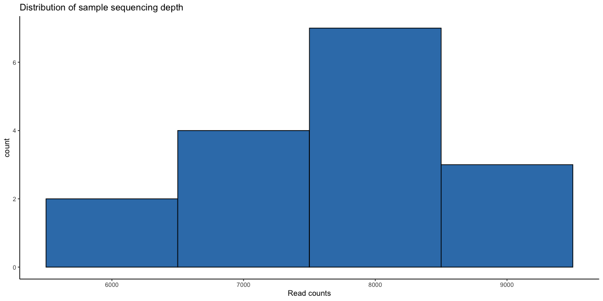
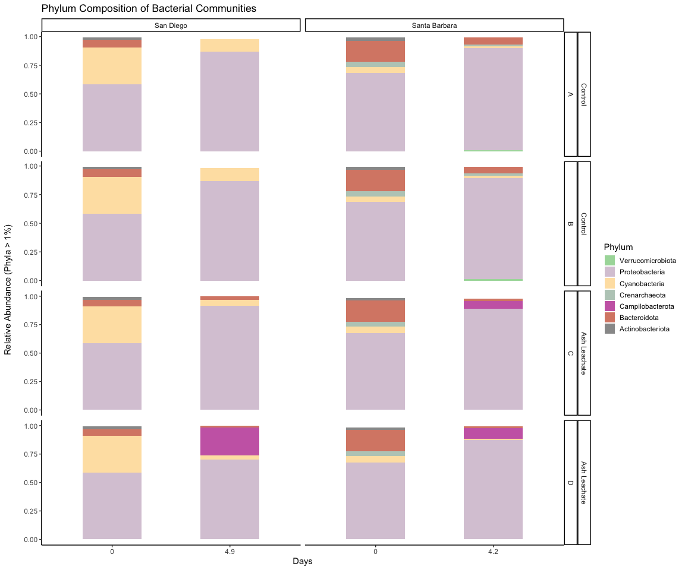
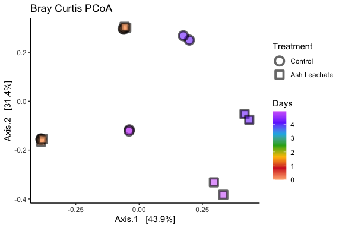
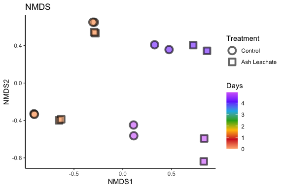
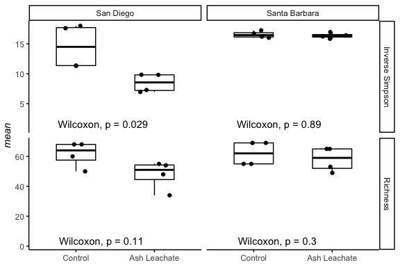

Phyloseq
================
Nicholas Baetge
8/13/2020

# Intro

We explore the processed ACIDD 16S sequences using phloseq

``` r
library(tidyverse) 
library(phyloseq)
library(RColorBrewer)
```

# Import Data

``` r
count.tab <- read_rds("~/GITHUB/eemb144l/Input_Data/week6/seqtab-nochimtaxa.rds") #table of counts for each sequence in each sample

tax.tab <- read_rds("~/GITHUB/eemb144l/Input_Data/week6/taxa.rds") #table that matches ASV to sequence


sample.tab <- read_rds("~/GITHUB/eemb144l/Output_Data/week4/ACIDD_Exp_Processed_DOC_BGE.rds") %>% 
  drop_na(DNA_SampleID) %>% 
  column_to_rownames(var = "DNA_SampleID") 
```

# Phyloseq Object

We need to create a phyloseq object that merges all three datasets.
Sometimes this doesn’t work beacuse of the format of the data files.
Make sure all the sample names between the sampleinfo.txt and
seqtab-nochimtaxa.txt are the same

``` r
OTU = otu_table(count.tab, taxa_are_rows = TRUE) 
TAX = tax_table(tax.tab)
SAM = sample_data(sample.tab)
ps = phyloseq(OTU,TAX,SAM) 
```

# Filter sequences

We will filter out chloroplasts and mitochondria, because we only
intended to amplify bacterial sequences. It’s good to check you don’t
have anything lurking in the taxonomy table.

``` r
sub_ps <- ps %>%
  subset_taxa(
    Family  != "mitochondria" &
    Class   != "Chloroplast"
  )
```

# Sample Summary

As a first analysis, we will look at the distribution of read counts
from our
samples



``` r
# mean, max and min of sample read counts
smin <- min(sample_sums(sub_ps)) #6048
smean <- mean(sample_sums(sub_ps)) #7686.875
smax <- max(sample_sums(sub_ps)) #9253
```

# Stacked Barplots

Let’s make a stacked barplot of Phyla to get a sense of the community
composition in these samples.

Since this is not a quantitative analysis, and since sometimes we can
have more Phyla in a dataset than we can reasonably distinguish colors,
we can prune out low abundance taxa and only include Phyla that
contribute more than x% (usually 1-2%) of the relative abundance of each
sample. Depending on your dataset and the taxonomic level you are
depicting, you can adjust this prune parameter.

``` r
# melt to long format (for ggploting) 
# prune out phyla below 1% in each sample

sub_ps_phylum <- sub_ps %>%
  tax_glom(taxrank = "Phylum") %>%                     # agglomerate at phylum level
  transform_sample_counts(function(x) {x/sum(x)} ) %>% # Transform to rel. abundance
  psmelt() %>%                                         # Melt to long format
  filter(Abundance > 0.01) %>%                         # Filter out low abundance taxa
  arrange(Phylum)                                      # Sort data frame alphabetically by phylum
```



# Unconstrained Ordination

One of the best exploratory analyses for amplicon data is unconstrained
ordinations. Here we will look at ordinations of our full community
samples. We will rarefy the samples first (scale to the smallest library
size).

## Rarefy

``` r
rarefy_ps = rarefy_even_depth(sub_ps, sample.size = min(sample_sums(sub_ps)), rngseed = 42398403)
```

    ## `set.seed(42398403)` was used to initialize repeatable random subsampling.

    ## Please record this for your records so others can reproduce.

    ## Try `set.seed(42398403); .Random.seed` for the full vector

    ## ...

    ## 1OTUs were removed because they are no longer 
    ## present in any sample after random subsampling

    ## ...

## PCoA

``` r
pcoa <- ordinate(rarefy_ps, method = "PCoA", distance = "bray")
```



## NMDS

Let’s try an NMDS instead. For NMDS plots it’s important to set a seed
since the starting positions of samples in the alogrithm is random.

Important: if you calculate your bray-curtis distance metric “in-line”
it will perform a square root transformation and Wisconsin double
standardization. If you don’t want this, you can calculate your
bray-curtis distance separately

``` r
set.seed(1)

# Ordinate
nmds <- ordinate(rarefy_ps, method = "NMDS",  distance = "bray") # stress = 0.09
```

    ## Square root transformation
    ## Wisconsin double standardization
    ## Run 0 stress 0.03978046 
    ## Run 1 stress 0.1688957 
    ## Run 2 stress 0.03978045 
    ## ... New best solution
    ## ... Procrustes: rmse 5.986468e-06  max resid 1.129694e-05 
    ## ... Similar to previous best
    ## Run 3 stress 0.2081898 
    ## Run 4 stress 0.3121157 
    ## Run 5 stress 0.03978045 
    ## ... Procrustes: rmse 8.679767e-07  max resid 1.786461e-06 
    ## ... Similar to previous best
    ## Run 6 stress 0.03978045 
    ## ... Procrustes: rmse 4.407738e-06  max resid 8.574829e-06 
    ## ... Similar to previous best
    ## Run 7 stress 0.03978045 
    ## ... Procrustes: rmse 2.183481e-06  max resid 3.72896e-06 
    ## ... Similar to previous best
    ## Run 8 stress 0.03978045 
    ## ... Procrustes: rmse 4.096093e-06  max resid 1.059995e-05 
    ## ... Similar to previous best
    ## Run 9 stress 0.03978045 
    ## ... Procrustes: rmse 3.031329e-06  max resid 5.617034e-06 
    ## ... Similar to previous best
    ## Run 10 stress 0.03978045 
    ## ... Procrustes: rmse 4.237417e-06  max resid 7.831443e-06 
    ## ... Similar to previous best
    ## Run 11 stress 0.03978045 
    ## ... Procrustes: rmse 2.600293e-06  max resid 4.705399e-06 
    ## ... Similar to previous best
    ## Run 12 stress 0.2266139 
    ## Run 13 stress 0.03978046 
    ## ... Procrustes: rmse 1.90472e-05  max resid 3.66935e-05 
    ## ... Similar to previous best
    ## Run 14 stress 0.03978045 
    ## ... Procrustes: rmse 3.906954e-06  max resid 7.257772e-06 
    ## ... Similar to previous best
    ## Run 15 stress 0.03978045 
    ## ... Procrustes: rmse 2.143813e-06  max resid 3.819952e-06 
    ## ... Similar to previous best
    ## Run 16 stress 0.03978045 
    ## ... Procrustes: rmse 9.058126e-07  max resid 1.707719e-06 
    ## ... Similar to previous best
    ## Run 17 stress 0.03978045 
    ## ... Procrustes: rmse 3.105943e-06  max resid 5.720812e-06 
    ## ... Similar to previous best
    ## Run 18 stress 0.365821 
    ## Run 19 stress 0.03978045 
    ## ... Procrustes: rmse 3.847314e-06  max resid 7.472299e-06 
    ## ... Similar to previous best
    ## Run 20 stress 0.03978045 
    ## ... Procrustes: rmse 2.647316e-06  max resid 5.123011e-06 
    ## ... Similar to previous best
    ## *** Solution reached



NMDS plots attempt to show ordinal distances between samples as
accurately as possible in two dimensions. It is important to report the
stress of these plots, because a high stress value means that the
algorithm had a hard time representing the distances between samples in
2 dimensions. The stress of this plot was good - it was .03 (generally
anything below .2 is considered acceptable). The PCoA for this data was
able to show ~74% variation in just two dimensions, so we may want to
stick with that plot.

# Alpha Diversity

Estimating alpha diversity of microbial communities is
[problematic](https://www.ncbi.nlm.nih.gov/pmc/articles/PMC93182/) no
matter what you do. We will use the rarefied library, which retains
estimates of the species abundance of the real population while
standardizing sampling effort.

``` r
# Initialize matrices to store richness and evenness estimates
nsamp = nsamples(rarefy_ps)
trials = 100

richness <- matrix(nrow = nsamp, ncol = trials)
row.names(richness) <- sample_names(rarefy_ps)

evenness <- matrix(nrow = nsamp, ncol = trials)
row.names(evenness) <- sample_names(rarefy_ps)

# It is always important to set a seed when you subsample so your result is replicable 
set.seed(3)

for (i in 1:100) {
  # Subsample
  r <- rarefy_ps
  
  # Calculate richness
  rich <- as.numeric(as.matrix(estimate_richness(r, measures = "Observed")))
  richness[ ,i] <- rich
  
  # Calculate evenness
  even <- as.numeric(as.matrix(estimate_richness(r, measures = "InvSimpson")))
  evenness[ ,i] <- even
}
```

Let’s calculate the mean and standard deviation per sample for observed
richness and inverse simpson’s index and store those values in a
dataframe.

``` r
# Create a new dataframe to hold the means and standard deviations of richness estimates
DNA_ID <- row.names(richness)
mean <- apply(richness, 1, mean)
sd <- apply(richness, 1, sd)
measure <- rep("Richness", nsamp)
rich_stats <- data.frame(DNA_ID, mean, sd, measure)

# Create a new dataframe to hold the means and standard deviations of evenness estimates
DNA_ID <- row.names(evenness)
mean <- apply(evenness, 1, mean)
sd <- apply(evenness, 1, sd)
measure <- rep("Inverse Simpson", nsamp)
even_stats <- data.frame(DNA_ID, mean, sd, measure)
```

Now we will combine our estimates for richness and evenness into one
dataframe

``` r
alpha <- rbind(rich_stats, even_stats)
```

Let’s add the sample metadata into this
dataframe

``` r
alphadiv <- left_join(alpha, sample.tab %>% rownames_to_column(., var = "DNA_ID")) %>% 
  arrange(Location, Bottle, Timepoint)
```

    ## Joining, by = "DNA_ID"

``` r
library(ggpubr)

# my_comparisons <- list( c("Control", "Ash Leachate"))

alphadiv %>% 
  ggboxplot(., x = "Treatment", y = "mean", 
            order = c("Control", "Ash Leachate"),
            xlab = F, 
            ylab = expression(italic(paste("mean"))),
            add = "jitter",
            width = 0.5,
            ggtheme = theme_classic()) + 
  facet_grid(measure~ Location, scales = "free") +
  # stat_compare_means(comparisons = my_comparisons, 
  #                    label = "p.signif",
  #                    step.increase = 0.5) + # if you have more than two groups
  stat_compare_means(label.y = 1) 
```


Boxes represent the 1.5 interquartile range, with the internal solid
line representing the median. Circles represent data points. p-values
are reported the non-parametric two sample Wilcoxon test, which tests
whether the means between two groups are equal (ns: p \> 0.05, \* : p≤
0.05, \*\* : p ≤ 0.01).

# Custom Table

phyloseq objects can sometimes be hard to handle when you have a
particular plot in mind that you want to make. to make it easier for us:
we’ll extract the relative abundance data from the object and merge them
with the taxa and sample info data as a new dataframe

## Generate relative abundances

Our data currently shows the relative proportion of different sequences
to the total number of gene copies recovered, so we’ll normalize the
gene copy number

``` r
ps_std <- transform_sample_counts(sub_ps, function(x) x/sum(x))
#extract the relative abundance table and coerce into dataframe
ps_std.tab <- as(otu_table(ps_std), "matrix")
ps_std.df = as.data.frame(ps_std.tab) 
```

## Table with Rel Abund, Taxa, Sample Info

Create a new table that combines relative abundances with the taxa table

``` r
#first coerce the taxa table into a data frame
tax.df = as.data.frame(tax.tab) 
#then combine the data frames
custom.tab <- tax.df %>% 
  rownames_to_column(., var = "asv") %>% 
  left_join(., ps_std.df %>% rownames_to_column(., var = "asv")) %>% 
  #create a new index of that combines the  class, order, family, and genus values
  mutate(cofg = paste(Class, "_", Order,"_", Family, "_", Genus )) %>% 
  select(-c(asv:Genus)) %>% 
  select(cofg:everything()) 
```

    ## Joining, by = "asv"

    ## Warning in x:y: numerical expression has 17 elements: only the first used

``` r
#save the row names and then make them into the column names
colnames <- custom.tab[,1]

#transpose the dataframe so we can merge with the sample info table
t_custom.tab <-  as.data.frame(t(custom.tab[,-1]))
colnames(t_custom.tab) <- colnames

#merge
sweet.tab <- t_custom.tab %>% 
  rownames_to_column(., var = "sample") %>% 
  left_join(., sample.tab %>% rownames_to_column(., var = "sample")) %>% 
  select(sample, Experiment:sd_bge, everything()) %>% 
  arrange(Location, Bottle, Timepoint)
```

    ## Warning: The `.data` argument of `add_column()` must have unique names as of tibble 3.0.0.
    ## Use `.name_repair = "minimal"`.
    ## This warning is displayed once every 8 hours.
    ## Call `lifecycle::last_warnings()` to see where this warning was generated.

    ## Joining, by = "sample"

## Save

``` r
saveRDS(sweet.tab, "~/GITHUB/eemb144l/Output_Data/week6/Custom_ASV_Table.rds")
saveRDS(sub_ps, "~/GITHUB/eemb144l/Output_Data/week6/phyloseq_obj.rds")
saveRDS(rarefy_ps, "~/GITHUB/eemb144l/Output_Data/week6/rarefied_phyloseq_obj.rds")
saveRDS(alphadiv, "~/GITHUB/eemb144l/Output_Data/week6/alphadiv.rds")
```
